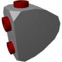

  

|Component|`LowVoltageJunction`|
|---|---|
|**Module**|`ARCHEAN_junction`|
|**Mass**|1 kg|
|[**Size**](# "Based on the component's occupancy in a fixed 25cm grid.")|25 x 25 x 25 cm|
#
---

# Description
La Low Voltage Junction consente di distribuire l'energia a 4 porte per alimentare più componenti da una singola fonte di alimentazione.

> - La Low Voltage Junction non consente di combinare l'energia utilizzandola al contrario, funziona in una sola direzione.
> - La potenza disponibile viene distribuita dinamicamente in base alla domanda, consentendo di collegare le junction in catena liberamente per alimentare i componenti secondo necessità.
> - È possibile monitorare il consumo energetico di ogni porta così come la potenza in ingresso dalla finestra informativa accessibile con il tasto `V`.
