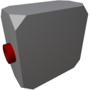

  

|Component|`LowVoltageRelay`|
|---|---|
|**Module**|`ARCHEAN_junction`|
|**Mass**|1 kg|
|[**Size**](# "Based on the component's occupancy in a fixed 25cm grid.")|25 x 25 x 25 cm|
#
---

# Description
Il Low Voltage Relay è un dispositivo che alimenta un componente consentendo il passaggio della corrente solo se un valore di segnale diverso da zero viene inviato alla sua porta dati.

> La faccia con due porte è destinata al collegamento della fonte di alimentazione e della porta dati.
>
> L'uscita energetica si trova sulla faccia con una singola porta.
