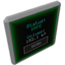

  

|Component|`Volume`|
|---|---|
|**Module**|`ARCHEAN_build`|
|**Mass**|1 kg|
|[**Size**](# "Based on the component's occupancy in a fixed 25cm grid.")|25 x 50 x 50 cm|
#
---

# Description
Il componente Volume, quando aggiunto a una costruzione, calcola e definisce automaticamente il volume che occupa. Questa funzione puo' essere utilizzata per:
- Progettare serbatoi di carburante personalizzati.
- Garantire la pressurizzazione della cabina per ambienti specifici (ad esempio, sottomarini, razzi).
- Creare dirigibili...
- ...

> <strong> Questo componente e' legato alla pressurizzazione delle costruzioni. Per maggiori informazioni, consultare la pagina [Pressurization](../../pressurization.md).</strong>

# Usage
Il componente Volume e' facile da usare e non richiede alcuna configurazione speciale. Basta aggiungerlo a una costruzione e fare clic sul pulsante `Scan` per rilevare automaticamente il volume del compartimento sigillato in cui e' posizionato. Si noti che calcola solo il volume del compartimento in cui si trova, non l'intera costruzione. Sara' necessario aggiungere un componente Volume separato per ogni compartimento che si desidera pressurizzare.

Questo componente puo' mostrare due stati:
- `Airtight`: lo stato diventa verde se il compartimento e' completamente sigillato.
- `Leak`: lo stato diventa rosso se il compartimento non e' ermetico.

Lo schermo del Volume mostra solo il volume del compartimento sigillato in metri cubi (m³). Per informazioni piu' dettagliate, e' possibile accedere alla finestra informativa premendo il tasto `V`. I dati disponibili includono:
- `Volume capacity (m³)`: la capacita' totale del volume sigillato.
- `Contents Mass (kg)`: la massa totale del contenuto presente nel volume.
- `Pressure (kPa)`: la pressione all'interno del compartimento sigillato.
- `Liquid Level (%)`: la percentuale di riempimento del liquido.
- `Composition`: la distribuzione dei diversi fluidi come percentuali normalizzate.

In modalita' Creative, appaiono pulsanti aggiuntivi per consentire il riempimento o lo svuotamento del volume.

### List of outputs
|Channel|Function|Value|
|---|---|---|
|0|Level|0 to 1|
|1|Volume (m³)|number|
|2|State|text|

