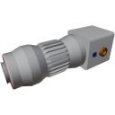

  

|Component|`BigTurboPump`|
|---|---|
|**Module**|`ARCHEAN_thruster`|
|**Mass**|200 kg|
|[**Size**](# "Based on the component's occupancy in a fixed 25cm grid.")|50 x 50 x 150 cm|
|**Push/Pull Fluid**|Initiate Push/Pull|
#
---

# Description
La Big Turbo Pump e' un componente utilizzato per trasferire fluidi ad alta densita' fino a 100 kg al secondo.

# Usage
## Power Supply
Per utilizzare la pompa, deve essere alimentata ad alta tensione. Consuma fino a 100 kW alla velocita' massima.

## Data
La porta dati consente di controllare la velocita' della pompa inviando un valore tra `-1` e `1`.
Quando la pompa e' collegata a un computer, e' anche possibile recuperare la portata attuale.

> Inviando un valore negativo, la pompa funzionera' effettivamente in senso inverso.
