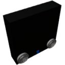

  

|Component|`PassiveRadiator`|
|---|---|
|**Module**|`ARCHEAN_machines`|
|**Mass**|25 kg|
|[**Size**](# "Based on the component's occupancy in a fixed 25cm grid.")|100 x 100 x 25 cm|
|**Push/Pull Fluid**|Accept Push -> Forwards action to other side|
#
---

# Description
Il Passive Radiator e' un componente utilizzato per raffreddare lentamente i fluidi scambiando calore con l'ambiente o irradiandolo nello spazio. Non richiede alcuna alimentazione.

# Usage
La sua efficienza di raffreddamento dipende da:
- La temperatura ambiente
- La densita' dell'ambiente circostante

Lo scambio di calore avviene tramite conduzione (migliorata con densita' piu' elevata) e radiazione.
Quando un fluido lo attraversa, la sua temperatura tende a equalizzarsi con la temperatura del componente.

### List of outputs
|Channel|Function|Type|
|---|---|---|
|0|Temperature (K)|number|

