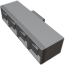

  

|Component|`ItemJunction`|
|---|---|
|**Module**|`ARCHEAN_junction`|
|**Mass**|20 kg|
|[**Size**](# "Based on the component's occupancy in a fixed 25cm grid.")|25 x 25 x 100 cm|
|**Push/Pull Item**|Accept Push/Pull -> Forwards action to other side|
#
---
# Description
L'Item Junction e' un componente che permette la distribuzione o l'aggregazione di oggetti.
Non influisce sull'impilamento.

# Usage
L'Item Junction trasferisce gli oggetti secondo la logica mostrata nell'immagine di esempio qui sotto. Le porte sulla faccia che contiene 4 porte comunicano solo con la porta sulla faccia che ne contiene una sola.

Quando gli oggetti entrano dalla porta inferiore di questo componente, utilizzano una logica round robin per la distribuzione.

  

