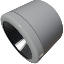

  

|Component|`SpotLight`|
|---|---|
|**Module**|`ARCHEAN_light`|
|**Mass**|1 kg|
|[**Size**](# "Based on the component's occupancy in a fixed 25cm grid.")|25 x 25 x 25 cm|
#
---

# Description
Lo SpotLight e' un componente che permette di illuminare un'ampia area con un angolo massimo di 120°. E' particolarmente adatto per essere posizionato sui veicoli come faro.

# Usage
Lo SpotLight deve essere alimentato a bassa tensione e consuma fino a 1000 W a seconda della potenza impostata nel suo menu informativo accessibile tramite il tasto `V`.

I colori dello SpotLight possono essere modificati tramite il suo menu informativo o tramite la sua porta dati.

### List of inputs
|Channel|Function|Range|
|---|---|---|
|0|Off/On|0 or 1|
|1|Red|0 to 255|
|2|Green|0 to 255|
|3|Blue|0 to 255|
