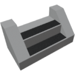

  

|Component|`Step`|
|---|---|
|**Module**|`ARCHEAN_misc`|
|**Mass**|1 kg|
|[**Size**](# "Based on the component's occupancy in a fixed 25cm grid.")|25 x 100 x 100 cm|
#
---

# Description
Lo Step e' un componente che appare come una piastra, permettendo la creazione di scale.

# Usage
Lo Step puo' essere posizionato sui blocchi e consente di salire o scendere da un blocco all'altro utilizzando il suo collider, che ha una forma triangolare (vedi la figura sotto).

Questo sistema permette di creare scale completamente personalizzabili.

