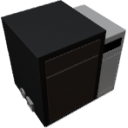

  

|Component|`ChemicalFurnace`|
|---|---|
|**Module**|`ARCHEAN_chemical`|
|**Mass**|500 kg|
|[**Size**](# "Based on the component's occupancy in a fixed 25cm grid.")|150 x 200 x 200 cm|
|**Push/Pull Fluid**|Accept Push / Initiate Push|
|**Push/Pull Item**|Accept Push / Initiate Push|
#
---

# Description
Il componente Chemical Furnace riscalda fluidi e oggetti, generalmente per eseguire reazioni chimiche.

# Usage
Richiede alimentazione elettrica per funzionare. Il suo consumo energetico varia in base alla temperatura target e al contenuto riscaldato, e puo' raggiungere fino a **5 MW** nelle condizioni piu' impegnative.

La Chemical Furnace e' inoltre dotata di un touchscreen che permette di:
- Visualizzare la temperatura attuale
- Impostare manualmente una temperatura target

### List of inputs
|Channel|Function|Range|
|---|---|---|
|0|Target Temperature (K)|number|
|1|Purge|0 or 1|

### List of outputs
|Channel|Function|Type|
|---|---|---|
|0|Current Temperature (K)|number|
