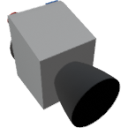

  

|Component|`MiniThruster`|
|---|---|
|**Module**|`ARCHEAN_thruster`|
|**Mass**|10 kg|
|[**Size**](# "Based on the component's occupancy in a fixed 25cm grid.")|25 x 25 x 25 cm|
|**Push/Pull Fluid**|Accept Push|
#
---

# Description
Il Mini Thruster genera spinta attraverso la combustione di carburante liquido con ossigeno liquido.
Puo' utilizzare sia CH4 (metano) che H2 (idrogeno) come carburante, ma richiede una combinazione carburante-ossidante pre-miscelata.
Puo' produrre fino a 18 KN di spinta con una portata di 1 Kg/s di LOX e H2 pre-miscelati.
  
# Usage
Collegare ossidante e carburante ad alto flusso alle porte di fluido, bassa tensione per l'accensione, e inviare 1 nella porta dati per accendere.

Quando il carburante e' H2, il rapporto di flusso ottimale e' 8:1 (LOX:H2) e un rapporto < 1:1 puo' causare uno spegnimento (nessuna combustione).
Quando il carburante e' CH4, il rapporto di flusso ottimale e' 4:1 (LOX:CH4) e un rapporto < 1:1 puo' causare uno spegnimento (nessuna combustione).

L'accenditore non deve essere mantenuto attivo una volta iniziata la combustione, anche se e' buona pratica lasciarlo acceso in caso di spegnimento.
L'accensione consuma 100 watt continuamente quando attiva.

### List of inputs
|Channel|Function|Range|
|---|---|---|
|0|Ignition|0 or 1|

### List of outputs
|Channel|Function|Unit|
|---|---|---|
|0|Thrust|Newtons|
|1|Burned flow|kg/s|
|2|Unburned flow|kg/s|
