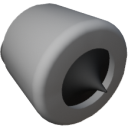

  

|Component|`SmallThruster`|
|---|---|
|**Module**|`ARCHEAN_thruster`|
|**Mass**|50 kg|
|[**Size**](# "Based on the component's occupancy in a fixed 25cm grid.")|25 x 50 x 50 cm|
|**Push/Pull Fluid**|Accept Push|
#
---

# Description
Lo Small Thruster genera spinta attraverso la combustione di carburante liquido con ossigeno liquido.
Puo' utilizzare sia CH4 (metano) che H2 (idrogeno) come carburante.
Utilizza un ugello aerospike radiale ed e' molto efficiente nel convertire l'energia di combustione direttamente in spinta.
Puo' produrre fino a 180 KN di spinta con una portata di 10 Kg/s di LOX e 1,25 Kg/s di H2.

# Usage
Collegare ossidante e carburante ad alto flusso alle porte di fluido, alta tensione per l'accensione, e inviare 1 nella porta dati per accendere.

L'accensione iniziale avverra' solo quando la portata e' tra 1 g/s e 5 kg/s, sia per il carburante che per l'ossidante.

Quando il carburante e' H2, il rapporto di flusso ottimale e' 8:1 (LOX:H2) e un rapporto < 1:1 puo' causare uno spegnimento (nessuna combustione).
Quando il carburante e' CH4, il rapporto di flusso ottimale e' 4:1 (LOX:CH4) e un rapporto < 1:1 puo' causare uno spegnimento (nessuna combustione).

L'accenditore non deve essere mantenuto attivo una volta iniziata la combustione, anche se e' buona pratica lasciarlo acceso in caso di spegnimento.
L'accensione consuma 1000 watt continuamente quando attiva.

L'ugello dello Small Thruster puo' effettuare il gimbal con una variazione da -10 a +10 gradi su due assi.

### List of inputs
|Channel|Function|Range|
|---|---|---|
|0|Ignition|0 or 1|
|1|Gimbal X|-1.0 to +1.0|
|2|Gimbal Z|-1.0 to +1.0|

### List of outputs
|Channel|Function|Unit|
|---|---|---|
|0|Thrust|Newtons|
|1|Burned flow|kg/s|
|2|Unburned flow|kg/s|

> Se il serbatoio di carburante e' pre-miscelato, non e' necessario utilizzare entrambe le porte di fluido.
