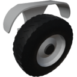

  

|Component|`Wheel`|
|---|---|
|**Module**|`ARCHEAN_wheel`|
|**Mass**|100 kg|
|[**Size**](# "Based on the component's occupancy in a fixed 25cm grid.")|50 x 75 x 100 cm|
#
---

# Description
La Wheel e' un componente che permette a una costruzione di accelerare avanti/indietro, sterzare e frenare. Include sospensioni e cambio configurabili.

# Usage
Puo' essere configurata tramite la sua interfaccia di configurazione accessibile con il tasto `V`.

### Configuration Interface
Fornisce informazioni sulla ruota e ne consente la configurazione.
#### Information
- `Motor Rotation Speed`: Velocita' di rotazione del motore in rotazioni al secondo.
- `Wheel Rotation Speed`: Velocita' di rotazione della ruota in rotazioni al secondo.
- `Power`: Consumo energetico in watt.
- `Brake`: Valore di frenata della ruota.
- `Ground Speed`: Velocita' della ruota rispetto al suolo in m/s.
- `Gear Ratio`: Rapporto di velocita' della ruota.

#### Configuration
- `Mudguard`: Mostra/Nascondi il parafango.
- `Reverse`: Inverte la direzione di rotazione della ruota.
- `Grip`: Regola l'aderenza della ruota.
- `Suspension`: Regola le sospensioni della ruota.

### Energy
La ruota ha una porta di energia a bassa tensione e una porta di energia ad alta tensione.
### Low-Voltage Energy
In questa configurazione, la ruota consuma fino a 20 kW.
#### High-Voltage Energy
In questa configurazione, la ruota consuma fino a 200 kW.

> - E' possibile invertire la direzione di rotazione della ruota dal menu di configurazione accessibile con il tasto `V`. Questo regola anche l'orientamento del modello, incluso il disegno del battistrada. Questa impostazione non cambia la direzione della ruota.

### List of inputs
|Channel|Function|Value|
|---|---|---|
|0|Accelerate|-1.0 to +1.0|
|1|Steer|-1.0 to +1.0|
|2|Regen|0 or 1|
|3|Brake|0.0 to 1.0|
|4|Gearbox|-1.0 to +1.0|

### List of outputs
|Channel|Function|Value|
|---|---|---|
|0|Wheel Rotation Speed|rot/s|
|1|Ground Friction|0 to 1|
