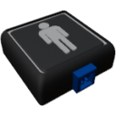

  

|Component|`PlayerSensor`|
|---|---|
|**Module**|`ARCHEAN_sensor1`|
|**Mass**|1 kg|
|[**Size**](# "Based on the component's occupancy in a fixed 25cm grid.")|25 x 25 x 25 cm|
#
---

# Description
Il PlayerSensor rileva i giocatori all'interno di un volume di delimitazione 3D configurabile relativo alla posizione e all'orientamento del sensore. Fornisce informazioni sui giocatori rilevati come oggetto di testo key-value.

# Usage
Una volta posizionato sulla costruzione, il PlayerSensor rileva qualsiasi giocatore che entra nella sua zona di rilevamento. La zona di rilevamento e' una scatola 3D che puo' essere configurata tramite il menu del tasto `V`.

Il sensore fornisce informazioni sui giocatori sul canale 0 come oggetto di testo key-value contenente:
- ID del giocatore
- Nome utente
- Distanza dal sensore

### V key configuration
- **box_min**: Coordinate minime della scatola di rilevamento (X, Y, Z) - Predefinito: -10, -10, -10
- **box_max**: Coordinate massime della scatola di rilevamento (X, Y, Z) - Predefinito: +10, +10, +10

Le coordinate della scatola di rilevamento sono relative alla posizione e all'orientamento del sensore.

### List of outputs
|Channel|Function|Value|
|---|---|---|
|0|Detected players|key-value text|

### Output format
L'uscita e' un oggetto di testo key-value: `.p<playerID>{.username{<name>}.distance{<meters>}}`
