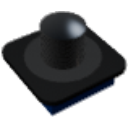

  

|Component|`TemperatureProbe`|
|---|---|
|**Module**|`ARCHEAN_build`|
|**Mass**|250 g|
|[**Size**](# "Based on the component's occupancy in a fixed 25cm grid.")|10 x 10 x 1 cm|
#
---

# Description
Il Temperature Probe è un componente che misura la temperatura del blocco o del pannello a cui è fissato.

# Usage
Una volta fissato sul tuo build, può essere collegato a un Computer per recuperare la temperatura del materiale nel punto di contatto della sua punta. La temperatura è fornita in Kelvin e aggiornata ogni 0,2 s. Indica 0 quando non tocca alcun blocco o pannello.

Sopra 1350 K la sonda si danneggia. Una sonda completamente danneggiata indica 0 e può essere riparata.

### List of outputs
|Channel|Function|Value|
|---|---|---|
|0|Temperature|Kelvin|
