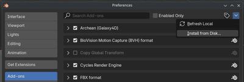

# 3D modeling with Blender

## Plugin Installation

Ecco due modi per installare il plugin in Blender.

### Method 1: Install from ZIP

1. Vai al repository del plugin [Archean Blender Plugin](https://github.com/batcholi/archean_blender_plugin)
2. Clicca il pulsante verde "Code" e scegli "Download ZIP"
3. Apri Blender
4. In Blender, vai su Edit > Preferences > Add-ons
5. Scegli "Install from Disk," poi seleziona il file ZIP scaricato

   
6. Dopo il completamento dell'installazione, abilita il plugin nella lista degli add-on.

### Method 2: Install by cloning the repository
1. Apri un terminale sul tuo sistema.
2. Clona il repository del plugin nella cartella degli add-on di Blender eseguendo:
   ```bash
   git clone https://github.com/batcholi/archean_blender_plugin <addons_path>
   ```
3. Avvia Blender e conferma che il plugin appaia nella lista degli add-on.
4. Abilita il plugin se necessario.

<font color="orange">Per gli utenti Windows:</font> Installa **Git** e usa `Git Bash` per clonare il repository. Nel prompt dei comandi (CMD), Git non sara' riconosciuto se il percorso dell'eseguibile non e' stato aggiunto alla variabile d'ambiente.

---

## Plugin Overview

Il plugin aggiunge due nuovi elementi a Blender:
1. Nel menu "Add" in modalita' Object, un nuovo tipo di oggetto **Archean Entity**, che aggiunge una struttura base per creare un nuovo componente.

	

2. Nella viewport, appare un menu **Archean** con varie impostazioni.

	

## Using the plugin

Un'entita' Archean e' sempre composta da una struttura specifica. Ecco i suoi elementi:

*Gli elementi contrassegnati in <font color="green">verde</font> sono obbligatori, quelli in <font color="orange">arancione</font> sono opzionali.*
- **<font color="green">Entity Root</font>**: L'oggetto radice dell'entita'. E' cruciale per l'esportazione e deve essere sempre presente.
- **<font color="green">Renderable</font>**: Un oggetto figlio dell'Entity Root. Questo e' l'oggetto visibile nel gioco. Puoi averne diversi, ma raccomandiamo di ottimizzare per mantenerne il minor numero possibile.
- **<font color="orange">Collider</font>**: Un figlio dell'Entity Root che definisce l'area di collisione. Un collider puo' contenere da 6 a 8 vertici. Puoi posizionare diversi collider in un'entita', ma incoraggiamo a mantenerne il numero basso per ragioni di prestazioni.
- **<font color="orange">Adapter</font>**: Un figlio dell'Entity Root, solitamente combinato con un **Single Arrow**, che definisce punti di connessione usati per cavi dati, energia, fluidi o oggetti.
- **<font color="orange">Joint</font>**: Un oggetto figlio dell'Entity Root che, solitamente combinato con un **Single Arrow**, definisce punti di articolazione per animare parti dell'entita' attraverso traslazione o rotazione. Un joint diventa il genitore di qualsiasi oggetto incluso al suo interno, inclusi altri joint.
- **<font color="orange">Target</font>**: Un oggetto figlio dell'Entity Root che, spesso combinato con un **Single Arrow**, definisce una posizione e direzione che puo' essere usata per aggiungere funzionalita' con XenonCode.

### Parameter overview
A seconda che tu abbia selezionato l'Entity Root o uno dei suoi figli, la lista delle impostazioni disponibili cambia.
#### Entity Root menu buttons
- **Export this Entity and Save**: Esporta l'entita' nella cartella dove e' salvato il file .blend e poi salva il file.
- **Generate Thumbnail**: Genera una miniatura dell'entita', che viene usata come icona nel gioco.
#### Entity Root parameters
- **Is Entity Root**: Seleziona questa casella per contrassegnare l'oggetto come Entity Root. Questo sblocca le funzionalita' specifiche dell'entita'.
- **Mass (kg)**: La massa dell'entita' in chilogrammi.
- **Airtight**: Definisce se l'entita' sara' ermetica all'interno del sistema di costruzione di Archean. Ricorda che il volume considerato e' quello del collider, non del renderable. Se nessun collider e' presente durante l'esportazione, il gioco ne crea automaticamente uno che avvolge l'entita'.
- **Base Plane is Minus Y**: Per default, il piano base dell'entita' e' allineato con l'asse -Z. Seleziona questa casella per allinearlo con l'asse -Y.
- **Export Vertex UVs**: Seleziona per esportare le coordinate UV. E' particolarmente importante quando si usano schermi, texture...

#### Child object menu button
- **Create Default Materials**: Archean usa una palette specifica per entita', porte e altro. Clicca questo pulsante per generare automaticamente i materiali predefiniti.
#### Child object parameters
- **Is Renderable**: Indica che questo oggetto sara' renderizzato nel gioco. Appare un sotto-parametro **Export Sharp Edges**, che permette di esportare i bordi contrassegnati come "Sharp" in Blender in modo che appaiano come wireframe negli ologrammi nel gioco.
- **Is Joint**: Contrassegna l'oggetto come joint. Appare una lista di sotto-parametri per abilitare vincoli di rotazione e traslazione.
- **Is Target**: Contrassegna l'oggetto come target utilizzabile per funzionalita'. La sua posizione e direzione contano a seconda dell'uso.
- **Is Collider**: Contrassegna l'oggetto come collider. I collider devono essere semplici e contenere tra 6 e 8 vertici. Appare un sotto-parametro **Is Build Block** in modo che il collider possa anche funzionare come blocco di costruzione, permettendo a entita' o blocchi di agganciarsi ad esso rimanendo allineati con la griglia di Archean.
- **Is Adapter**: Contrassegna l'oggetto come punto di connessione per cavi dati, energia, fluidi o oggetti. Un sotto-parametro a tendina e un pulsante **Create Mesh** permettono di generare la mesh del connettore direttamente.

> Il team di sviluppo di Archean solitamente si affida a oggetti **Single Arrow** per adapter, joint e target perche' sono semplicemente una posizione e una direzione.

---

## Creating your first entity

Il primo passo importante e' orientarsi correttamente nello spazio 3D. In Archean, l'asse Y e' avanti/indietro, l'asse X e' sinistra/destra e l'asse Z e' su/giu'.


1. Apri Blender e crea una nuova scena.
2. Elimina tutto cio' che e' attualmente nella scena (per default un cubo, una camera e una luce).
3. Nel menu "Add" in modalita' Object, aggiungi una nuova **Archean Entity**.

   Questo oggetto iniziale contiene un **Entity Root** e un semplice cubo contrassegnato come **Renderable**. Il nome dell'Entity Root e' il nome dell'entita' usato per l'esportazione e nel gioco.

   > Il nome dell'**Entity Root** non deve contenere spazi o caratteri speciali — solo caratteri alfanumerici.
4. Scala il cubo a `0.5 x 0.5 x 0.5`, cioe' `50 x 50 x 50 cm`, perche' il cubo predefinito e' troppo grande. *(Sono 2 x 2 x 2 metri nel gioco.)*
5. Salva il progetto in una cartella prima di proseguire per poter esportare l'entita' in seguito.
   > - Salva il progetto nella cartella del tuo componente: `Archean/Archean-data/mods/MYVENDOR_mymod/components/MyComponentName/`
   > - Vedi [Getting Started](getting-started.md) per come creare una mod e configurare questa struttura di cartelle.
   > - <font color="orange"> Una mod puo' contenere piu' componenti, ciascuno nella propria cartella.</font>
   > - <font color="red">/!\ Il nome della cartella del componente deve corrispondere al nome dell'Entity Root.</font>

### Adding the data port
Aggiungi un oggetto **Single Arrow** su una faccia del cubo per creare una porta dati. Genera la sua mesh, assegna il materiale corretto e uniscilo all'oggetto principale per evitare di creare un renderable separato. Poiche' le porte spesso usano lo smooth shading, applica un modificatore "Edge Split" all'oggetto principale per prevenire artefatti visivi.

<video src="./blender-res/dataport.mp4" width="700" height="438" controls loop muted></video>

### Adding a joint to rotate Suzanne
Aggiungi un oggetto **Single Arrow** sopra il cubo per definire un punto di articolazione. Contrassegnalo come **Is Joint** e abilita la rotazione solo attorno all'asse Z. Poi imposta come figli del joint gli oggetti — Suzanne (la testa di scimmia di Blender) e un cilindro per la base.

Poiche' Suzanne puo' ruotare completamente, imposta **-360** come valore **Low**, **0** come **Neutral** (posizione predefinita), e **360** come **High**.

<video src="./blender-res/joint.mp4" width="700" height="438" controls loop muted></video>

### Adding a screen
Per l'esempio, crea un oggetto che servira' come base per lo schermo. Prima assegna un materiale che assomigli a un display, poi fai l'unwrap delle UV selezionando la faccia dello schermo in modo che riempia l'intero editor UV.

> Assicurati di abilitare **Export Vertex UVs** sull'Entity Root in modo che le coordinate UV vengano esportate.
> L'aspetto del materiale dello schermo dipende da te; per esempio, puoi trasformare una superficie di vetro in uno schermo.

<video src="./blender-res/screen.mp4" width="700" height="438" controls loop muted></video>

### Adding a collider
Per finire, aggiungi un collider che definisce l'area di collisione dell'entita'. Aggiungi un cubo, scalalo per racchiudere l'intera entita' e posizionalo correttamente. Contrassegnalo come **Is Collider** e nascondilo nella viewport.

<video src="./blender-res/collider.mp4" width="700" height="438" controls loop muted></video>

### Port Management for XenonCode
La denominazione delle porte segue una convenzione specifica per renderle facili da identificare all'interno di XenonCode. Ecco come funziona:
- Le porte dati devono essere denominate **data** usando il formato `data.index`, o semplicemente `data` se ce n'e' una sola. Questa denominazione e' necessaria per potervi accedere usando `input.index` e `output.index` in XenonCode.
  Esempio con due porte dati: Denominale `data.0` e `data.1`. In XenonCode, vi accederesti usando `input.0` e `input.1`.
  Esempio con una singola porta dati: Denominala semplicemente `data`. In XenonCode, vi accederesti usando `input.0` e `output.0`.

- Tutti gli altri tipi di porta (Power, Fluid, Item, ecc.) non hanno requisiti di denominazione specifici. Il loro nome dichiarato viene usato direttamente in XenonCode.

### Generating the thumbnail and exporting
Una volta che tutto e' configurato, genera la miniatura ed esporta l'entita'.
- Rinomina correttamente l'Entity Root.
- Assicurati che Suzanne sia contrassegnata come Renderable.

<video src="./blender-res/suzanne.mp4" width="700" height="438" controls loop muted></video>

## Frequently Asked Questions
### Perche' a volte vedo un messaggio "Fix now" nel menu del plugin?
Gli oggetti devono avere la loro scala applicata per evitare problemi di esportazione. Il pulsante "Fix now" applica la scala a tutti gli oggetti nella scena in una volta. Di solito puoi prevenire il messaggio applicando la scala di un oggetto con **Ctrl + A** e scegliendo **Apply > Scale**.

### L'orientamento della miniatura non mi soddisfa. Come lo cambio?
Ruota l'Entity Root per cambiare come viene inquadrata la miniatura. Raccomandiamo di non applicare mai quella rotazione in modo da poter riportare l'entita' al suo orientamento originale facilmente. Devi rigenerare la miniatura solo quando l'aspetto visivo cambia.

### Perche' dovrei evitare di creare troppi Renderable?
Il motore di rendering di Archean e' al 100% ray tracing, quindi il numero di vertici conta poco. Il numero di oggetti, tuttavia, ha un impatto diretto sulle prestazioni. Tieni presente che `Numero di Renderable = renderable per entita' * numero di entita'` entro un raggio di circa 100 km, a seconda della dimensione finale dell'entita'. *(Piu' grande e' l'entita', maggiore e' il raggio di rendering.)*

### E' meglio visualizzare il testo come texture o come mesh?
Grazie al ray tracing, il testo mesh e' spesso piu' performante e ha un aspetto migliore perche' offre una qualita' visiva superiore e consuma poca VRAM rispetto alle texture.

### Sono abituato a creare asset low-poly per i giochi. Devo fare lo stesso per Archean?
Assolutamente no — puoi creare modelli molto dettagliati. Il ray tracing offre una qualita' visiva estremamente alta. Curiosita': Blender probabilmente crashera' prima di Archean. Divertiti con quei vertici!

### Quali colori usano i componenti ufficiali?
Quando generi i materiali usando **Create Default Materials**, **Color1** e' il bianco usato sulla maggior parte dei componenti, **Color2** e' il grigio metallico, e **Body** e' il nero. Gli altri materiali hanno nomi auto-esplicativi.
