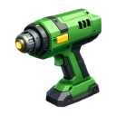

    

|Item|`ConstructorTool`|
|---|---|
|**Module**|`ARCHEAN_build`|

# Description
Il Constructor Tool e' lo strumento principale utilizzato per costruire in Archean. Permette di creare nuove costruzioni, aggiungere o rimuovere frame e posizionare blocchi di varie forme.

# Build Modes
Premi **C** per aprire il menu radiale e selezionare una modalita' di costruzione:

|Modalita'|Descrizione|
|---|---|
|**Frame**|Crea e modifica la struttura portante (travi d'acciaio)|
|**Cube**|Posiziona blocchi cubici|
|**Slope**|Posiziona blocchi inclinati/rampe|
|**Corner**|Posiziona blocchi angolari|
|**Pyramid**|Posiziona blocchi piramidali|
|**InvCorner**|Posiziona blocchi angolari invertiti|
|**Triangle**|Posiziona pannelli triangolari a mesh|
|**Wall / Platform**|Posiziona pannelli piatti per pareti o pavimenti|
|**Strut**|Posiziona travi strutturali sottili in acciaio|

# Materials
Quando si posizionano blocchi (non frame), usa la **rotellina del mouse** tenendo premuto **C** per selezionare il materiale.

## Material Masses

| Materiale | Massa per unita' |
|----------|---------------|
| Composite | 0,25 kg |
| Aluminium | 0,5 kg |
| Steel | 1 kg |
| Glass | 1 kg |
| Concrete | 10 kg |
| Lead | 150 kg |

> **Nota:** Le travi d'acciaio (frame) pesano **10 kg** ciascuna.

### Come viene calcolata la massa dei blocchi
L'unita' base e' un cubo di **25x25x25 cm**. La massa totale di un blocco dipende da:

1. **Dimensione**: I blocchi piu' grandi contengono piu' unita' (es. un blocco 50x50x50 cm = 8 unita')
2. **Forma**: Le forme non cubiche (slope, corner, pyramid, inverted corner) pesano il **50%** del loro equivalente cubico poiche' occupano meno volume
3. **Materiale**: Ogni materiale ha una massa per unita' diversa (vedi tabella sopra)

**Formula:** `Massa = unita' x fattore_forma x massa_materiale`
- `unita'` = (dimensione_x) x (dimensione_y) x (dimensione_z) in incrementi di 25 cm
- `fattore_forma` = 1.0 per cubi e pareti, 0.5 per slope, corner, pyramid e inverted corner. I triangoli hanno un costo variabile basato sulla loro area.

### Perche' le masse non corrispondono alla realta'
Le masse sono intenzionalmente semplificate:
- I valori sono **arrotondati** per leggibilita'
- I blocchi non sono solidi al 100% — rappresentano pannelli strutturali con un'intelaiatura interna, non blocchi pieni di materiale

# Removing Elements
Per rimuovere qualsiasi elemento (blocco, triangolo, strut o parete), puntalo tenendo premuto il **tasto destro**, poi premi rapidamente il **tasto sinistro**. Funziona da qualsiasi modalita' di costruzione.

> La rimozione dei frame ha i propri controlli (vedi la sezione Frame Mode qui sotto).

# Usage

## Frame Mode

### Creating a New Build
Tieni premuto il **tasto sinistro** per un secondo poi rilascia. Verra' creata una nuova costruzione con un singolo frame metallico 3x3x3.

> **Suggerimento:** Tieni premuto **Shift** durante la creazione per allineare il nuovo frame al terreno e impostarlo come statico (ancorato).

### Creating a Build in Space
Quando sei nello spazio vicino a una costruzione esistente, puoi creare una nuova costruzione che apparira' **5 metri davanti a te**. La nuova costruzione viene creata come figlia della costruzione radice piu' vicina. Funziona anche con il [Blueprint Tool](BlueprintTool.md).

### Adding Frames
Punta una faccia di un frame esistente e premi rapidamente il **tasto sinistro**.

### Removing Frames
Punta una faccia di un frame esistente tenendo premuto il **tasto destro**, poi premi rapidamente il **tasto sinistro**.

### Adding Individual Beams
Punta un frame esistente dove si troverebbe la trave tenendo premuto **Shift**, poi premi rapidamente il **tasto sinistro**.

### Removing Individual Beams
Punta una trave di un frame esistente tenendo premuti **Shift** e il **tasto destro**, poi premi rapidamente il **tasto sinistro**.

## Block Modes (Cube, Slope, Corner, Pyramid, InvCorner)

### Adding Blocks
1. Punta un blocco o una trave
2. Premi il **tasto sinistro** per posizionare il blocco
3. Usa la **rotellina del mouse** per ruotarlo (eccetto per i cubi)
4. Tieni premuto il **tasto sinistro** e trascina per ridimensionare
5. Usa la **rotellina del mouse** tenendo premuto il **tasto sinistro** per ridimensionare nell'altra dimensione

> **Suggerimento avanzato:** Il piano di trascinamento/ridimensionamento e' determinato dalla normale della faccia del blocco che stai puntando. La rotellina del mouse scala verso quella normale, mentre il trascinamento scala lungo gli altri due assi.

> **Suggerimento:** Tieni premuto **Shift** prima di premere il **tasto sinistro** per copiare il blocco che stai puntando o aggiungere logicamente il blocco successivo.

## Triangle Mode

La modalita' Triangle permette di posizionare pannelli triangolari a mesh che si agganciano alla griglia di costruzione. Questi pannelli sono utili per creare forme curve, superfici aerodinamiche o qualsiasi geometria non rettangolare.

### Placing Triangles
1. Clicca su **3 punti della griglia** (vertici di blocchi, triangoli o strut esistenti) per creare un triangolo
2. In alternativa, clicca su un **bordo esistente** per iniziare con 2 vertici gia' selezionati, cosi' sara' necessario un solo altro clic
3. Usa la **rotellina del mouse** durante il posizionamento per **invertire la direzione della normale** (controlla quale lato del triangolo e' rivolto verso l'esterno)
4. Tieni premuto **Shift** su una faccia di blocco allineata agli assi per un aggancio **sub-griglia** con precisione alla griglia completa di 25 cm
5. Premi il **tasto destro** per annullare l'ultimo vertice posizionato

> I triangoli si agganciano ai vertici di blocchi, altri triangoli e punti terminali degli strut. L'estensione massima e' di 4 m per asse.

### Materials
Tieni premuto **C** e usa la **rotellina del mouse** per selezionare il materiale. I triangoli supportano tutti gli stessi materiali dei blocchi.

### Smooth Shading
Premi **X** puntando un triangolo per attivare/disattivare lo smooth shading su tutti i triangoli connessi nello stesso gruppo. Lo smooth shading viene applicato usando un algoritmo di flood-fill: si propaga attraverso i **bordi condivisi** a tutti i triangoli adiacenti che formano una superficie continua.

Perche' lo smooth shading funzioni correttamente:
- I vertici dei triangoli devono **allinearsi esattamente** sulla griglia — i triangoli adiacenti devono condividere le stesse posizioni dei vertici
- Gruppi separati di triangoli (non connessi da bordi condivisi) sono trattati come **gruppi smooth indipendenti** — attivare lo smooth su un gruppo non influenza l'altro

> Lo smooth shading rispetta anche la modalita' di simmetria.

## Strut Mode

Gli strut sono travi strutturali sottili in acciaio che collegano due punti della griglia. Sono utili per creare tralicci, antenne, impalcature o elementi strutturali leggeri.

### Placing Struts
1. Clicca su **2 punti della griglia** per creare uno strut tra di essi
2. Gli strut si agganciano ai vertici di blocchi, triangoli e altri strut
3. Premi il **tasto destro** per annullare il primo vertice posizionato

> L'estensione massima e' di 4 m per asse. In modalita' avventura, gli strut richiedono oggetti **Steel Rod**.

### Subdivision Snapping
Tieni premuto **Shift** puntando uno strut esistente per agganciare ai punti di suddivisione lungo di esso. Usa la **rotellina del mouse** tenendo premuto **Shift** per cambiare il passo di suddivisione:

|Dimensioni del passo|
|---|
|1 m|
|50 cm|
|25 cm (predefinito)|
|10 cm|
|5 cm|

Questo permette di posizionare nuovi strut o triangoli a intervalli precisi lungo uno strut esistente.

## Wall / Platform Mode

### Adding Walls
Punta una faccia di un frame e premi rapidamente il **tasto sinistro**.

> **Suggerimento:** Tieni premuto **Shift** per usare l'altra faccia logica del frame che stai puntando.

> **Suggerimento:** Tieni premuto **Shift** durante il posizionamento per agganciare al terreno e creare una piattaforma statica direttamente davanti a te.

# Symmetry Mode
Il Constructor Tool supporta la costruzione simmetrica, permettendo di costruire strutture specchiate automaticamente.

La simmetria puo' essere abilitata tramite il menu **GetInfo** della costruzione (premi **V** su qualsiasi frame). Quando abilitata:
- Tutte le operazioni su frame e blocchi vengono specchiate lungo l'asse di simmetria
- La posizione dell'asse di simmetria puo' essere regolata con una **precisione di 0,125 m**, consentendo il posizionamento speculare al centro dei blocchi

# Adventure Mode
In modalita' avventura, sono necessari i materiali richiesti nell'inventario:
- **Steel Beams** per i frame
- **Oggetti blocco** (Composite, Concrete, Steel, ecc.) per i blocchi

Lo strumento mostrera' quanti materiali sono necessari per ogni operazione.

---

> **Suggerimento:** Attiva i tooltip tramite il menu **F1** per un aiuto contestuale durante l'uso del Constructor Tool.
