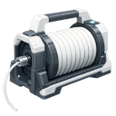
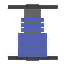

  

|Item|`SpoolTool`|
|---|---|
|**Module**|`ARCHEAN_build`|

# Description
Lo Spool Tool viene utilizzato per posizionare cavi e tubi che collegano i componenti tra loro, permettendo il trasferimento di dati, energia, oggetti o fluidi tra di essi.

# Spool Types
Premi **C** per aprire il menu di selezione spool. Ci sono 5 tipi di spool disponibili:

  
  
  
  
  

|Tipo|Colore|Utilizzo|
|---|---|---|
|**Data Cable**|Blu|Collega porte dati per il trasferimento di informazioni|
|**Low Voltage Cable**|Rosso|Collega porte di alimentazione a bassa tensione|
|**High Voltage Cable**|Arancione|Collega porte di alimentazione ad alta tensione|
|**Fluid Pipe**|Grigio|Collega porte fluidi per il trasferimento di liquidi/gas|
|**Item Conduit**|Grigio scuro|Collega porte oggetti per il trasferimento di oggetti|

Ogni tipo di spool puo' collegare solo porte compatibili. Gli spool possono essere impilati nell'inventario e la lunghezza rimanente viene visualizzata su ogni oggetto spool.

# Usage

## Selecting Spool Type
Premi **C** per aprire il menu di selezione spool e scegliere il tipo di cavo da posizionare.

## Creating a Cable (Connecting Two Components)
1. Punta il connettore di un componente e premi il **tasto sinistro** per iniziare il cavo
2. Clicca per aggiungere punti intermedi per modellare il percorso del cavo
3. Punta il connettore di destinazione e premi il **tasto sinistro** per completare la connessione

Durante la creazione del cavo:
- Il **tasto destro** rimuove l'ultimo punto posizionato (o annulla se non ci sono punti)
- La **rotellina del mouse** scorre tra percorsi alternativi suggeriti dal pathfinding automatico
- Tieni premuto **Shift** per agganciare i cavi alle superfici dei componenti
- Tieni premuto **X** per posizionare il cavo sulla faccia interna dei blocchi/componenti

## Auto Path-Finding
Lo Spool Tool dispone di un pathfinding automatico che suggerisce percorsi per i cavi. Usa la **rotellina del mouse** durante il posizionamento per scorrere tra le diverse permutazioni di percorso.

## Creating a Flexible Cable
Per collegare componenti su costruzioni diverse:
1. Inizia il cavo su una costruzione
2. Terminalo sul componente di un'altra costruzione

Questo crea un **Flexible Cable** che:
- Collega fisicamente le due costruzioni
- E' vincolato dal motore fisico
- Non ha limite di forza (non si stacchera')
- E' influenzato dalla gravita'

Puoi anche creare un cavo flessibile tra due componenti della **stessa costruzione** tenendo premuto **X**.

## Deleting a Cable
Tieni premuto il **tasto destro** poi premi rapidamente il **tasto sinistro** su un cavo esistente per eliminarlo.

## Painting Cables
Usa il [Paint Tool](PaintTool.md) per personalizzare l'aspetto dei cavi:
- La pittura normale cambia il colore del cavo
- Tieni premuto **Shift** per un effetto a strisce
- Tieni premuto **X** per sostituire il colore su tutti i cavi corrispondenti
- Combina entrambi per strisce trasparenti

---

> **Suggerimenti:**
> - Se un cavo si rifiuta di essere creato, potresti non avere abbastanza lunghezza rimanente nel tuo spool
> - I cavi non hanno limiti di trasferimento ne' perdite legate alla lunghezza
> - I cavi non determinano la direzione del trasferimento
> - Un cavo non puo' essere modificato una volta posizionato - devi eliminarlo e ricrearlo
> - I cavi flessibili influiscono sulle prestazioni piu' dei cavi normali - dai priorita' ai cavi normali quando possibile
> - Gli strumenti possono utilizzare oggetti da contenitori esterni posizionando lo strumento all'interno di quel contenitore
