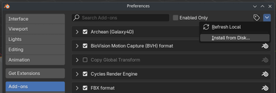
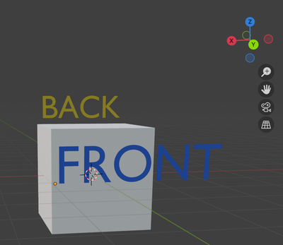

# 3D modeling with Blender

> <font color="red" size="5">The content on this page is currently available only in the **Experimental** version of Archean.</font>

## Plugin Installation

Here are two ways to install the plugin in Blender.

### Method 1: Install from ZIP

1. Go to the plugin repository [Archean Blender Plugin](https://github.com/batcholi/archean_blender_plugin)
2. Click the green "Code" button and choose "Download ZIP"
3. Open Blender
4. In Blender, go to Edit > Preferences > Add-ons
5. Choose "Install from Disk," then select the ZIP file you downloaded

   
6. After the installation finishes, enable the plugin in the add-ons list.

### Method 2: Install by cloning the repository
1. Open a terminal on your system.
2. Clone the plugin repository into Blender's add-ons folder by running:
   ```bash
   git clone https://github.com/batcholi/archean_blender_plugin <addons_path>
   ```
3. Launch Blender and confirm the plugin appears in the add-ons list.
4. Enable the plugin if needed.

<font color="orange">For Windows users:</font> Install **Git** and use `Git Bash` to clone the repository. In the command prompt (CMD), Git won't be recognized if the executable path hasn't been added to the environment variable.

---

## Plugin Overview

The plugin adds two new elements to Blender:
1. In the "Add" menu while in Object mode, a new object type **Archean Entity**, which adds a base structure for creating a new component.

	

2. In the viewport, an **Archean** menu appears with various settings.

	

## Using the plugin

An Archean entity is always made up of a specific structure. Here are its elements:

*Items marked in <font color="green">green</font> are required, those in <font color="orange">orange</font> are optional.*
- **<font color="green">Entity Root</font>**: The root object of the entity. It's crucial for export and must always be present.
- **<font color="green">Renderable</font>**: A child object of the Entity Root. This is the object that's visible in-game. You can have several, but we recommend optimizing to keep as few as possible.
- **<font color="orange">Collider</font>**: A child of the Entity Root that defines the collision area. A collider can contain 6 to 8 vertices. You can place several colliders in an entity, but we encourage keeping that number low for performance reasons.
- **<font color="orange">Adapter</font>**: A child of the Entity Root, usually combined with a **Single Arrow**, that defines connection points used for data, power, fluid, or item cables.
- **<font color="orange">Joint</font>**: A child object of the Entity Root that, usually combined with a **Single Arrow**, defines articulation points to animate parts of the entity through translation or rotation. A joint becomes the parent of any object included inside it, including other joints.
- **<font color="orange">Target</font>**: A child object of the Entity Root that, often combined with a **Single Arrow**, defines a position and direction that can be used for adding functionality with XenonCode.

### Parameter overview
Depending on whether you've selected the Entity Root or one of its children, the list of available settings changes.
#### Entity Root menu buttons
- **Export this Entity and Save**: Exports the entity to the folder where the .blend file is saved and then saves the file.
- **Generate Thumbnail**: Generates a thumbnail of the entity, which is used as its icon in the game.
#### Entity Root parameters
- **Is Entity Root**: Check this box to mark the object as the Entity Root. This unlocks entity-specific features.
- **Mass (kg)**: The entity's mass in kilograms.
- **Airtight**: Defines whether the entity will be airtight within Archean's building system. Remember that the volume considered is that of the collider, not the renderable. If no collider is present during export, the game automatically creates one encompassing the entity.
- **Base Plane is Minus Y**: By default, the entity's base plane aligns with the -Z axis. Check this box to align it with the -Y axis instead.
- **Export Vertex UVs**: Check this to export UV coordinates. It's particularly important when using screens, textures..

#### Child object menu button
- **Create Default Materials**: Archean uses a specific palette for entities, ports, and more. Click this button to generate the default materials automatically.
#### Child object parameters
- **Is Renderable**: Marks that this object will be rendered in-game. A sub-parameter **Export Sharp Edges** appears, allowing you to export edges marked as "Sharp" in Blender so that they appear as wireframe in holograms in the game.
- **Is Joint**: Marks the object as a joint. A list of sub-parameters appears to enable rotation and translation constraints.
- **Is Target**: Marks the object as a target usable for functionality. Its position and direction matter depending on usage.
- **Is Collider**: Marks the object as a collider. Colliders must be simple and contain between 6 and 8 vertices. A sub-parameter **Is Build Block** appears so the collider can also act as a build block, allowing entities or blocks to snap onto it while staying aligned with the Archean grid.
- **Is Adapter**: Marks the object as a connection point for data, power, fluid, or item cables. A dropdown sub-parameter and a **Create Mesh** button let you generate the connector mesh directly.

> The Archean development team usually relies on **Single Arrow** objects for adapters, joints, and targets because they're simply a position and a direction.

---

## Creating your first entity

The first important step is to orient yourself properly in 3D space. In Archean, the Y-axis is forward/back, the X-axis is left/right, and the Z-axis is up/down.



1. Open Blender and create a new scene.
2. Delete everything currently in the scene (by default a cube, a camera, and a light).
3. In the "Add" menu in Object mode, add a new **Archean Entity**.

   This initial object contains an **Entity Root** and a simple cube marked as **Renderable**. The Entity Root's name is the entity name used for export and in-game.

   > The **Entity Root** name must not contain spaces or special characters—only alphanumeric characters.
4. Scale the cube to `0.5 x 0.5 x 0.5`, i.e., `50 x 50 x 50 cm`, because the default cube is too large. *(That's 2 x 2 x 2 meters in-game.)*
5. Save the project in a folder before going further so you can export the entity later.
   > For modding, save the project to the game folder
   > `Archean/Archean-game/modules/ARCHEAN_mod/components/MyComponentName/`
   >
   > <font color="red">**/!\ The component folder name must match the Entity Root name.**</font>

### Adding the data port
Add a **Single Arrow** object on one face of the cube to create a data port. Generate its mesh, assign the correct material, and join it to the main object to avoid creating a separate renderable. Because ports often use smooth shading, apply an "Edge Split" modifier to the main object to prevent visual artifacts.

<video src="./blender-res/dataport.mp4" width="700" height="438" controls loop muted></video>

### Adding a joint to rotate Suzanne
Add a **Single Arrow** object on top of the cube to define an articulation point. Mark it as **Is Joint** and enable rotation around the Z-axis only. Then parent the joint's child objects—Suzanne (Blender's monkey head) and a cylinder for the base.

Since Suzanne can rotate fully, set **-360** as the **Low** value, **0** as **Neutral** (default position), and **360** as **High**.

<video src="./blender-res/joint.mp4" width="700" height="438" controls loop muted></video>

### Adding a screen
For the example, create an object that will serve as the base for the screen. First assign a material that looks like a display, then unwrap the UV by selecting the screen face so it fills the entire UV editor.

> Make sure to enable **Export Vertex UVs** on the Entity Root so UV coordinates are exported.
> The screen material's look is up to you; for instance, you can turn a glass surface into a screen.

<video src="./blender-res/screen.mp4" width="700" height="438" controls loop muted></video>

### Adding a collider
To finish, add a collider that defines the entity's collision area. Add a cube, scale it to enclose the entire entity, and position it correctly. Mark it as **Is Collider** and hide it in the viewport.

<video src="./blender-res/collider.mp4" width="700" height="438" controls loop muted></video>

### Port Management for XenonCode
Port naming follows a specific convention to make them easy to identify within XenonCode. Here’s how it works:
- Ports can be named using the format `yourName.index`, or simply `yourName` if there’s only one port of that type.
- If you need multiple ports of the same type, each must have a unique index, for example: `data.0`, `data.1`, etc.
- When a port has no explicit index, it is automatically considered to have index 0.

Example:  
If you have two data ports named `data.0` and `data.1`, you must use `input.0` and `input.1` in your XenonCode script to interact with them.  
This indexing logic applies equally to all types of ports.

### Generating the thumbnail and exporting
Once everything is configured, generate the thumbnail and export the entity.
- Rename the Entity Root properly.
- Make sure Suzanne is marked as a Renderable.

<video src="./blender-res/suzanne.mp4" width="700" height="438" controls loop muted></video>

## Frequently Asked Questions
### Why do I sometimes see a "Fix now" message in the plugin menu?
Objects need to have their scale applied to avoid export issues. The "Fix now" button applies the scale to every object in the scene at once. Usually you can prevent the message by applying an object's scale with **Ctrl + A** and choosing **Apply > Scale**.

### The thumbnail orientation doesn't suit me. How do I change it?
Rotate the Entity Root to change how the thumbnail is framed. We recommend never applying that rotation so you can return the entity to its original orientation easily. You only need to regenerate the thumbnail when the visuals change.

### Why should I avoid creating too many Renderables?
Archean's rendering engine is 100% ray tracing, so the number of vertices matters little. The number of objects, however, has a direct impact on performance. Keep in mind that `Number of Renderables = renderables per entity * number of entities` within a radius of roughly 100 km, depending on the entity's final size. *(The larger the entity, the larger the render radius.)*

### Is it better to display text as a texture or as a mesh?
Thanks to ray tracing, mesh text is often more performant and looks better because it offers higher visual quality and consumes little VRAM compared to textures.

### I'm used to making low-poly assets for games. Should I do the same for Archean?
Not at all—you can create very detailed models. Ray tracing delivers extremely high visual quality. Fun fact: Blender will probably crash before Archean does. Have fun with those vertices!

### What colors do official components use?
When you generate materials using **Create Default Materials**, **Color1** is the white used on most components, **Color2** is the metallic gray, and **Body** is the black. The other materials have self-explanatory names.