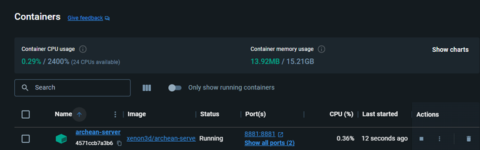

Archean offers a multiplayer experience, allowing you to open your single-player games to other players or set up a dedicated server.

# Hardware Requirements
To ensure the proper functioning of an Archean server in multiplayer mode, the following minimum configuration is recommended:
- **Processor**: Prioritize high power per core (i7, Ryzen...)
- **Memory**: Minimum of 8 GB of RAM

This setup may change depending on the platform used (Windows, Linux, etc.) and future game updates.

# Network
Regardless of the operating system choice, you must ensure that port `8881` is open for both `UDP` & `TCP`.

# Operating System
## Linux
To set up a dedicated server on a Linux server, you will need `curl` as well as `Docker` in order to execute the automatic installation script.

Installing Docker can significantly vary depending on the distribution used. We recommend consulting the Wiki of your distribution for guidance on successful installation.

To install the server with the official script, here are the steps to follow:
```bash
# Download the install script
curl -s -o install_archean_server.sh https://archean.space/assets/user_scripts/run_server_with_docker.sh

# Make it executable
chmod +x install_archean_server.sh

# Run this script to Install or Update the server
./install_archean_server.sh
```

## Windows
Standalone windows servers are not supported yet, but coming soon.

There is a possibility to host a server using Docker Desktop and WSL 2. If you want to try, the guide is following.
Best luck : :D
You can achieve this by following these 4 steps  
* [Download and Install Docker](#download-and-install-docker)
* [Download and Install Archean Server Image](#download-and-install-archean-server-image)
* [Preparing a working folder for the server](#preparing-working-folder-for-server)
* [Launch, Stop and Restart the Server](#launch-stop-and-restart-server)

## Download and Install Docker

1. Download Docket for Windows from the official site : [https://www.docker.com/](https://www.docker.com/)

    

2. Start the installer
3. Select "Use WSL 2 instead of Hyper-V (recommanded)"

    

4. Once installation is complete, start Docker and accept agreement

    

5. If you want to create an account, you may sign up, else, just continue without signing in

    

6. Answer the survey, or SKIP IT

## Download and Install Archean Server image

1. In the search bar, at the top, or by pressing CTRL+K, search for "xenon3d"

    

2. Pull the image "xenon3d/archean-server-alpha" using the "latest" tag

3. When the image is pulled, you should see it in the "images" tab

    

## Preparing working folder for server

These steps _assume_ you have created a folder to your disk drive named **H** in a folder named _jeux_.
Please, **replace all occurrence** of _H:\Jeux_ by your **actual** server root folder.

1. To well organize your server, create a folder named **Archean**, in wich you will create a folder named **dedicated_server**.

    

2. Create a folder named **server.data**

    

3. In the folder **server.data**, create a file named _server.ini_ and paste the following content :

        [server]
        server_online = yes
        server_public_name = YOUR_SERVER_PUBLIC_NAME
        accept_remote_connections = yes
        max_simultaneous_players = 16
        password =
        #0 = creative, 1 = survival
        game_mode= 0
        [game]
        world = YOUR_WORLD_NAME
        spawn = earth
        spawn_x = 2802212.000000
        spawn_y = -106687.000000
        spawn_z = -5532944.000000
        updates_per_second = 25
        physics_steps_per_update = 8
        auto_save_interval_seconds = 30
        [networking]
        listen_port = 8881
        listen_new_connection_timeout_ms = 500
        automatic_blacklist = no

> Be sure to customize this file before starting your server, so that everybody may find your server in the list.

## Launch, Stop and Restart Server

Prior to launching your server, **be sure to have opened ports 8881 both for TCP and UDP protocol on your router**. This way, your server will be visible in the game client.
Be also sure to **route these ports to the computer hosting the server** on the _same ports_.  
Finally, **set your firewall** to accept connection on these ports to allow communication between your server and other players.

Now, let's start 😁

1. In Docker, open the **Terminal**

  

2. If it's the first time, enable it

  

3. Then, to start the server and create the container **the first time**, enter the command bellow:

`docker run -it -d -p 8881:8881/TCP -p 8881:8881/UDP --name archean-server  -v H:\jeux\Archean\dedicated_server\server.data:/Archean-data/server xenon3d/archean-server-alpha`

4. Switch to the **Containers** tab, you should see the new container up and running

  

5. Now, launch the game client and go to the **Multiplayer** tab. If, like me, you forget to change the name of your server, you chould see it listed among the others 😁

  

6. To stop your server, click on the **stop** button

  

7. To restart your server, click on the **dots** button, then on the **restart** button

  

8. To start your server, once it is stopped, click on the **start** button

  

After all these steps, you should see your server listed, and you should be able to connect to your server from the game client.

However, you can host a game while playing it if you configure `server.ini` with the following:  
- `server_online = yes`
- `server_public_name = <Any name you want>`
- `accept_remote_connections = yes`  

Then, whenever you hit `Play` in the launcher, a public server will be listed and others can join.  
Again, don't forget to open your port 8881 (or anything have set in `listen_port`).

> When you configure your game (locally) to be publicly accessible, if you have changed the default port (8881) in the `server.ini` file, you will also need to change the port in the `client.ini` file so that you can connect to your own local server.

# Managing Administrators
## Information
An administration panel is accessible in the game with the `F4` key.
It displays the server load and its speed in ticks per second. *(25 ticks/s being the default maximum tick rate guaranteeing optimal performance)*

A checkbox `Admin Privileges` allows, among other things, to spawn blueprints for free when the game mode is set to `Adventure`.

The panel also offers two tabs:
- **Players**: Allows you to see the list of connected players, teleport to them, and/or kick them.
- **Entities**: Allows you to see the list of entities present on the server, delete them, and/or teleport to them.

## Adding/Removing an Administrator
To add an administrator, simply modify the file `/Archean-data/server/admins.txt`.
This file should contain a list of player IDs, one per line.
If the player uses Steam, their Steam64 ID should be used.