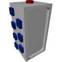

  

|Component|`MiniRouter`|
|---|---|
|**Module**|`ARCHEAN_computer`|
|**Mass**|5 kg|
|[**Size**](# "Based on the component's occupancy in a fixed 25cm grid.")|25 x 25 x 50 cm|
#
---

# Description
Mini Router — это уменьшенная версия [Router](Router.md), имеющая всего 14 портов данных.

Для работы требуется низковольтное питание, потребление составляет 50 ватт.

Как и стандартный Router, он позволяет назначать псевдонимы (aliases) компонентам и может объединяться в цепочку с другими маршрутизаторами для расширения сети.

> Mini Router, который напрямую взаимодействует с компьютером, должен быть запитан. Другие маршрутизаторы в цепочке не требуют питания и могут использоваться как [Data Bridge](DataBridge.md), сохраняя при этом способность разрешать псевдонимы и ссылки на экраны.
