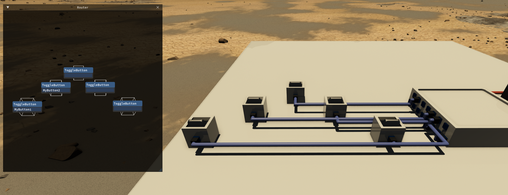

  

|Component|`Router`|
|---|---|
|**Module**|`ARCHEAN_computer`|
|**Mass**|20 kg|
|[**Size**](# "Based on the component's occupancy in a fixed 25cm grid.")|100 x 100 x 25 cm|
#
---

# Description
Router — это устройство, используемое для подключения различных компонентов к сети. Его основное преимущество — возможность подключения практически неограниченного количества компонентов, которыми можно управлять с одного или нескольких компьютеров в сети. В отличие от этого, возможность подключения отдельного компьютера к компонентам ограничена количеством доступных портов.

Каждый Router оснащён 30 портами данных. Их можно объединять в цепочку для увеличения общего количества доступных портов, умножая порты на количество соединённых между собой маршрутизаторов.

Для работы требуется низковольтное питание, потребление составляет 50 ватт.

> - Невозможно иметь несколько отдельных сетей маршрутизаторов, подключённых к разным портам одного компьютера. Компьютер может взаимодействовать только с одной единой сетью маршрутизаторов, но эта сеть может включать неограниченное количество объединённых в цепочку маршрутизаторов.

# Usage
Когда Router включён и подключён к компонентам, он позволяет назначать псевдонимы (aliases) компонентам через трёхмерный визуальный интерфейс, которые впоследствии можно использовать для идентификации этих компонентов из кода компьютера.

Открыть интерфейс маршрутизатора можно клавишей `F`.

Интерфейс представляет собой 3D-среду (см. изображение ниже), в которой можно перемещаться, удерживая `Mouse Right-Click`, используя стандартные клавиши движения `WASD`, `CONTROL/SPACE` для перемещения вниз/вверх и `Shift` для ускорения движения.

Компоненты расположены в их реальных 3D-позициях относительно друг друга в конструкции и включают все подключённые компоненты из всех маршрутизаторов в цепочке.

У каждого компонента отображается метка, в которую можно ввести псевдоним, который впоследствии будет использоваться на компьютере. Чтобы узнать, как использовать псевдонимы, обратитесь к странице XenonCode IDE.

Также можно назначить псевдоним компоненту напрямую, отобразив его информационное окно клавишей `V`, как показано в примере ниже.

# Controlling multiple components with a single alias
В некоторых ситуациях бывает удобно управлять несколькими компонентами, выполняющими одну и ту же функцию, с помощью одного псевдонима. Для этого достаточно добавить звёздочку `*` в конце псевдонима в nodes/Xenoncode. Например, если вы строите самолёт и у вас четыре элерона на левом крыле, вы можете назвать их следующим образом:
- `leftAileron1`
- `leftAileron2`
- `leftAileron3`
- `leftAileron4`

Затем вы можете управлять ими, используя псевдоним `leftAileron*`. Звёздочка `*` позволяет выбрать все компоненты, псевдоним которых начинается с `leftAileron`.

# Additional information:
- Маршрутизаторы, которые напрямую взаимодействуют с компьютером, должны быть запитаны; другие маршрутизаторы в цепочке не требуют питания. Это также позволяет использовать [MiniRouter](MiniRouter.md) как [Data Bridge](DataBridge.md) (без питания), но в отличие от [DataBridge](DataBridge.md), он способен разрешать псевдонимы и ссылки на экраны.

- Для маршрутизации данных Router обязательно должен быть подключён к компьютеру или другому маршрутизатору. Нельзя использовать схему вида `Computer > DataBridge/DataJunction > Router`.
