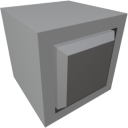

  

|Component|`PushButton`|
|---|---|
|**Module**|`ARCHEAN_hid`|
|**Mass**|1 kg|
|[**Size**](# "Based on the component's occupancy in a fixed 25cm grid.")|25 x 25 x 25 cm|
#
---

# Description
Push Button постоянно отправляет значение `1`, пока он нажат, и `0` в остальное время.

# Usage
Кнопка активируется клавишей `F` и остаётся активной, пока клавиша удерживается.

## Configuration
В меню настроек, доступном по клавише `V`:

| Option | Description |
|--------|-------------|
| **Dual-Sided** | Делает кнопку доступной с обеих сторон |
| **Single Pulse** | При включении кнопка отправляет `1` на один тик, а затем сразу сбрасывается в `0`, вместо того чтобы оставаться активной при удержании |
