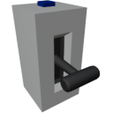

  

|Component|`ThrottleLever`|
|---|---|
|**Module**|`ARCHEAN_hid`|
|**Mass**|1 kg|
|[**Size**](# "Based on the component's occupancy in a fixed 25cm grid.")|25 x 25 x 50 cm|
#
---

# Description
Throttle Lever — это тип управления, который постоянно отправляет аналоговое значение в зависимости от положения рычага. Выходное значение соответствует настраиваемому диапазону (по умолчанию от `-1.0` до `+1.0`).

# Usage
Рычаг управляется мышью: удерживайте клавишу `F` и перемещайте `мышь вверх/вниз`.

> - В центре рычага есть сопротивление, помогающее точно найти центральное положение.
> - Можно настроить значения **Min** и **Max** рычага, а также функцию **snap-to-center** в меню настроек, доступном по клавише `V`.
> - Throttle Lever можно управлять с другого компонента через порт данных, включив режим "Allow IO Input" в меню настроек.
