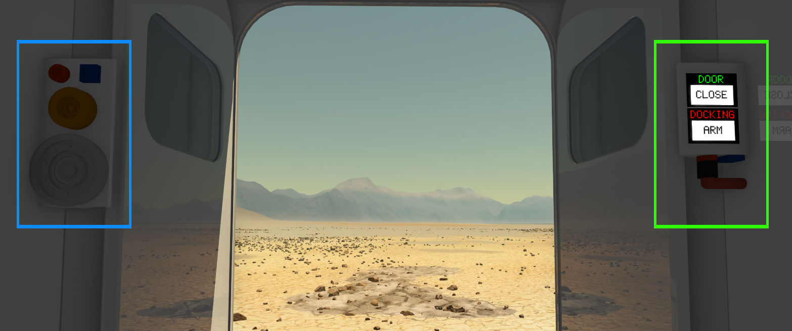

  

|Component|`DockableDoor`|
|---|---|
|**Module**|`ARCHEAN_build`|
|**Mass**|400 kg|
|[**Size**](# "Based on the component's occupancy in a fixed 25cm grid.")|250 x 250 x 100 cm|
|**Push/Pull Fluid**|Accept Push/Pull -> Forwards action to other side|
#
---

# Description
Dockable Door — это большая дверь, которая может стыковаться с аналогичной дверью для соединения двух конструкций. Стыковка позволяет передавать данные, энергию и жидкости между соединёнными конструкциями, а также физически связывает их вместе. Они зафиксированы друг относительно друга.

> - Dockable Door можно устанавливать только на грань рам (frames).
> - Dockable Door может стыковаться только с другой Dockable Door.
> -  *Этот компонент связан с герметизацией конструкций. Подробнее см. на странице [Pressurization](../../pressurization.md).*

# Usage
Для правильной работы Dockable Door необходимо низковольтное питание. Потребление составляет 20 ватт в неактивном состоянии и до 250 ватт, когда двери находятся в движении.

На внутренней стороне двери расположены две панели для взаимодействия с дверью или передачи данных, энергии или жидкостей через стыковочный порт.

Ниже приведено изображение, иллюстрирующее две панели.
- Панель, отмеченная зелёным, предназначена для взаимодействия с дверью, её питания и дистанционного управления через порт данных. (Таблица ниже описывает входы/выходы порта данных)
- Панель, отмеченная синим, предназначена для подключения различных кабелей, передающих данные, энергию или жидкости к/от другой пристыкованной двери.

### Использование с псевдонимами (aliases)
Использование стандартных псевдонимов для обоих портов одновременно невозможно, поскольку объект отображает только одно поле псевдонима в информационном окне (`V`). Аналогично, [Router](../computers/Router.md) отображает только одно поле псевдонима на компонент.
Для раздельного использования портов данных с псевдонимами необходимо использовать [Data Bridge](../computers/DataBridge.md) или [Data Junction](../computers/DataJunction.md). Это позволяет назначать псевдонимы этим объектам вместо стыковочных портов.

### List of inputs
|Channel|Function|
|---|---|
|0|Close/Open Door|
|1|Arm/Disarm Dock|

### List of outputs
|Channel|Function|
|---|---|
|0|Door State|
|1|Dock State|
