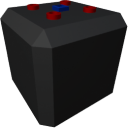

  

|Component|`LowVoltageBattery`|
|---|---|
|**Module**|`ARCHEAN_battery`|
|**Mass**|10 kg|
|[**Size**](# "Based on the component's occupancy in a fixed 25cm grid.")|50 x 50 x 50 cm|
#
---

# Description
- Напряжение: от 44 до 52 вольт в зависимости от текущего уровня заряда
- Ток: 1000 ампер на порт
- Общая ёмкость: 10 кВт·ч
- Электрические порты: 4
- Порт данных: 1 порт для мониторинга состояния батареи

> **Переработка:** При разрушении эта батарея возвращает примерно **50%** стоимости крафта в виде сырой руды.

# Usage
Батарея обеспечивает 1000 ампер на порт, что позволяет получить до 52 кВт на каждом порту для питания компонентов.

### List of outputs
|Channel|Function|
|---|---|
|0|Voltage|
|1|Max Capacity (Wh)|
|2|State of charge|
|3|Throughputs (watts)|
