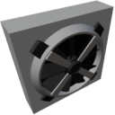

  

|Component|`ActiveRadiator`|
|---|---|
|**Module**|`ARCHEAN_machines`|
|**Mass**|40 kg|
|[**Size**](# "Based on the component's occupancy in a fixed 25cm grid.")|100 x 100 x 25 cm|
|**Push/Pull Fluid**|Accept Push -> Forwards action to other side|
#
---

# Description
Active Radiator — компонент, предназначенный для охлаждения жидкостей, проходящих через него. Оснащён вентилятором, который при активации значительно улучшает теплообмен с окружающей средой.

# Usage
Радиатор требует:
- Электропитания
- Входного сигнала данных для активации вентилятора.

Без питания его охлаждающая способность очень ограничена. При подключении питания и активации он медленно выравнивает температуру между циркулирующей жидкостью и окружающей средой.

Постоянное потребление составляет 100 Вт при подключении питания.

### List of outputs
|Channel|Function|Type|
|---|---|---|
|0|Temperature (K)|number|
