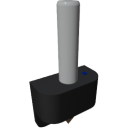

  

|Component|`GroundAnchor`|
|---|---|
|**Module**|`ARCHEAN_anchor`|
|**Mass**|25 kg|
|[**Size**](# "Based on the component's occupancy in a fixed 25cm grid.")|25 x 100 x 100 cm|
#
---

# Description
Ground Anchor — устройство, которое при активации фиксирует постройку на земле, предотвращая любое перемещение.

# Usage
Ground Anchor работает без внешнего питания. Его механизм основан на простом значении: `0` — деактивирован (не закреплён) или `1` — активирован (закреплён) через порт данных.

>- Для освобождения закреплённой постройки недостаточно просто удалить Ground Anchor. Необходимо либо снять якорение текущего Ground Anchor, либо установить новый Ground Anchor, чтобы реактивировать физику постройки, при условии, что на ней больше нет активных якорей.
>- При наличии [OwnerPad](OwnerPad.md) использование кнопки "Reset" для перемещения постройки НЕ будет заблокировано Ground Anchor.
>- Ground Anchor не может закрепить транспортное средство на другом транспортном средстве — он работает только с рельефом.
