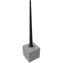

  

|Component|`Beacon`|
|---|---|
|**Module**|`ARCHEAN_beacon`|
|**Mass**|2 kg|
|[**Size**](# "Based on the component's occupancy in a fixed 25cm grid.")|25 x 25 x 25 cm|
#
---

# Description
Beacon — компонент, позволяющий передавать и/или принимать данные от других Beacon.

# Usage
Для работы Beacon должен быть подключён к низковольтному питанию и потребляет 10 Вт во время работы.
Его можно настроить для передачи и/или приёма данных через порты данных или интерфейс настройки, доступный по клавише `V`.

При размещении Beacon на голограмме появляется стрелка, указывающая направление локализации маяка.

## Интерфейс настройки
- `Transmit Data`: позволяет отправлять данные `number/text`.
- `Transmit Frequency`: позволяет настроить частоту передачи.
- `Receive Frequency`: позволяет настроить частоту приёма.
#### Информация
- `Last Received Distance`: отображает расстояние в метрах до последнего маяка, от которого были получены данные.
- `Last Received Direction`: отображает направление (x,y,z) до последнего маяка, от которого были получены данные.
- `Last Received Data`: отображает последние полученные данные.
- `Is Receiving`: показывает, принимает ли маяк данные в данный момент.

## Порт данных
Beacon имеет порт данных, позволяющий использовать его с компьютера или других компонентов.

### List of outputs
|Channel|Function|Range|
|---|---|---|
|0|Data|number or text|
|1|Distance|number (meters)|
|2|Direction X|-1.0 to +1.0|
|3|Direction Y|-1.0 to +1.0|
|4|Direction Z|-1.0 to +1.0|
|5|Is Receiving|0 or 1|

### List of inputs
|Channel|Function|Range|
|---|---|---|
|0|Transmit Data|number or text|
|1|Transmit Frequency|number or text|
|2|Receive Frequency|number or text|

> Информация:
>- Ограничений по дальности связи между маяками нет, однако ближайший маяк имеет приоритет, если несколько маяков вещают на одной частоте.
>- Сигнал маяка не блокируется препятствиями.

> Подсказки:
>- Beacon может передавать только одни данные за раз — число или текст. Но можно использовать систему [Key-Value objects](../../xenoncode/documentation.md#key-value-objects) для передачи любого количества данных.
