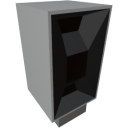

<p align="center">
  
</p>

|Component|`TerrainScanner`|
|---|---|
|**Module**|`ARCHEAN_celestial`|
|**Mass**|5 kg|
|[**Size**](# "Based on the component's occupancy in a fixed 25cm grid.")|50 x 25 x 25 cm|
#
---

# Description
Terrain Scanner — компонент, позволяющий получать высоту рельефа в одной или нескольких точках (по расстоянию) в направлении его датчика. Работает только на планетах и лунах.

# Usage
С технической точки зрения сканер очень прост. Вы отправляете ему число в канал 0, соответствующее расстоянию в метрах, на котором хотите просканировать рельеф по горизонтали, и сканер возвращает число, соответствующее высоте на этом расстоянии в направлении датчика.

Возвращаемая высота для Земли указана относительно уровня моря.

Его преимущество в возможности отправки нескольких расстояний в разных каналах для одновременного сканирования нескольких точек за один серверный тик (по умолчанию 25 раз в секунду).

> Никогда не направляйте его вниз/вверх — он лучше всего работает при горизонтальном сканировании.

## Пример
Для сканирования рельефа на расстоянии 10 м отправьте значение 10 во входной канал 0. Сканер вернёт число, соответствующее высоте на расстоянии 10 м в соответствующем выходном канале.

Для сканирования рельефа на расстояниях 10 м и 20 м отправьте значение 10 во входной канал 0 и значение 20 во входной канал 1. Сканер вернёт число, соответствующее высоте на расстоянии 10 м в выходном канале 0 и другое число для расстояния 20 м в выходном канале 1.

С помощью этих возможностей можно, например, использовать цикл XenonCode для сканирования всех высот в радиусе 100 м с шагом 10 м и вывода их в консоль.

```xc
    repeat 10 ($i)
        output_number($scanner_io, $i, $i*10)
        print(input_number($scanner_io, $i))
```

Имейте в виду, что существует задержка в 1 тик между отправкой на выход и получением со входа.
Сканер выдаёт результаты на основе значений, отправленных ему в предыдущем тике, поэтому не меняйте значения расстояний между каналами и не используйте случайные значения — старайтесь сохранять их постоянными на протяжении нескольких тиков.

## Дополнительные возможности
Terrain Scanner сканирует рельеф в направлении своего датчика. Его можно установить на Small Pivot, чтобы, например, вращать его и создавать карту высот вокруг его позиции с помощью программы XenonCode и внутриигровых экранов.

## Энергия
Terrain Scanner потребляет низковольтную энергию для работы. Потребление прямо пропорционально количеству используемых каналов. Чем больше точек вы сканируете за один тик, тем больше энергии потребляется — 100 Вт на канал за тик.
