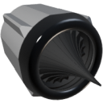

  

|Component|`BigThruster`|
|---|---|
|**Module**|`ARCHEAN_thruster`|
|**Mass**|400 kg|
|[**Size**](# "Based on the component's occupancy in a fixed 25cm grid.")|100 x 100 x 100 cm|
|**Push/Pull Fluid**|Accept Push|
#
---

# Description
Big Thruster создаёт тягу за счёт сгорания жидкого топлива с жидким кислородом.
Может работать как на CH4 (метане), так и на H2 (водороде).
Использует радиальное аэроспайк-сопло и очень эффективно преобразует энергию сгорания непосредственно в тягу.
Способен производить до 1,8 МН тяги при расходе 100 кг/с LOX и 12,5 кг/с H2.

# Usage
Подключите мощный поток окислителя и топлива к жидкостным портам, высоковольтное питание для зажигания, и отправьте 1 в порт данных для воспламенения.

Начальное зажигание произойдёт только при расходе от 1 г/с до 50 кг/с для топлива или окислителя.

При использовании H2 оптимальное соотношение потоков — 8:1 (LOX:H2), соотношение < 1:1 может привести к затуханию (прекращению горения).
При использовании CH4 оптимальное соотношение потоков — 4:1 (LOX:CH4), соотношение < 1:1 может привести к затуханию (прекращению горения).

Зажигатель не нужно держать включённым после начала горения, хотя рекомендуется оставлять его включённым на случай затухания.
Зажигание потребляет 1000 Вт непрерывно во включённом состоянии.

Сопло Big Thruster может отклоняться (gimbal) в диапазоне от -10 до +10 градусов по двум осям.

### List of inputs
|Channel|Function|Range|
|---|---|---|
|0|Ignition|0 or 1|
|1|Gimbal X|-1.0 to +1.0|
|2|Gimbal Z|-1.0 to +1.0|

### List of outputs
|Channel|Function|Unit|
|---|---|---|
|0|Thrust|Newtons|
|1|Burned flow|kg/s|
|2|Unburned flow|kg/s|

> Если топливный бак содержит предварительно смешанное топливо, использовать оба жидкостных порта не обязательно.
