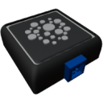

  

|Component|`DensitySensor`|
|---|---|
|**Module**|`ARCHEAN_sensor1`|
|**Mass**|1 kg|
|[**Size**](# "Based on the component's occupancy in a fixed 25cm grid.")|25 x 25 x 25 cm|
#
---

# Description
Density Sensor — компонент, измеряющий плотность и состав окружающей среды, в которой он находится.

# Usage
После установки на постройку его можно подключить, например, к компьютеру для получения плотности и состава окружающей среды. Состав передаётся в виде строки key-value.

### List of outputs
|Channel|Function|value|
|---|---|---|
|0|Density (kg/m³)|number|
|1|Composition|text|
