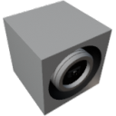

  

|Component|`DistanceSensor`|
|---|---|
|**Module**|`ARCHEAN_sensor1`|
|**Mass**|2 kg|
|[**Size**](# "Based on the component's occupancy in a fixed 25cm grid.")|25 x 25 x 25 cm|
#
---

# Description
Distance Sensor — лазерный дальномер, измеряющий расстояние до ближайшей поверхности (рельеф или постройка). Обнаруживает как рельеф, так и коллайдеры других построек в настраиваемом диапазоне.

# Usage
После установки на постройку требуется подключение низковольтного питания и порта данных для работы. Датчик испускает луч вдоль своей передней грани. При включении входа "Show Laser" отображается видимый красный лазерный луч до обнаруженной поверхности.

### Дальность и многотиковое сканирование
Дальность по умолчанию — 1000 м (один тик, мгновенный результат). Дальность можно увеличить до 25 000 м через входной канал "Max Range". При дальности свыше 1000 м сканирование рельефа распределяется по нескольким серверным тикам (128 шагов рельефа за тик):

|Range|Ticks|Delay|
|---|---|---|
|1,000 m|1|мгновенно|
|5,000 m|5|~200 мс|
|10,000 m|10|~400 мс|
|25,000 m|25|~1 с|

> Обнаружение объектов (построек) всегда мгновенное, независимо от дальности. Только трассировка рельефа распределяется по тикам.

### List of inputs
|Channel|Function|Value|
|---|---|---|
|0|On/Off|number (≠ 0 = on)|
|1|Show Laser|number (≠ 0 = on)|
|2|Max Range|number (meters, 1000-25000, default 1000)|

### List of outputs
|Channel|Function|Value|
|---|---|---|
|0|Distance|number (meters, -1 if out of range)|

>- В неактивном состоянии или при выходе за пределы дальности выход равен -1.
>- Датчик не обнаруживает собственную постройку.
>- Датчик может обнаруживать аватаров.
