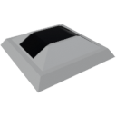

    

|Component|`SolarSensor`|
|---|---|
|**Module**|`ARCHEAN_celestial`|
|**Mass**| 1 kg|
|[**Size**](# "Based on the component's occupancy in a fixed 25cm grid.")|25 x 25 x 25 cm|
#

---

# Description
Solar Sensor — компонент, измеряющий угол падения солнечного света и потенциальную солнечную мощность.

# Usage
После установки на постройку датчик можно подключить к компьютеру для получения нормализованного значения угла падения, обычно указывающего положение солнца относительно позиции датчика. Датчик также позволяет получать потенциальное значение принимаемой солнечной мощности в Вт/м².

> - Можно настроить отслеживание солнца солнечной панелью без компьютера, подключив эти датчики напрямую к петлям.

### List of outputs
|Channel|Function|Value|
|---|---|---|
|0|Normalized Angle|-1.0 to +1.0|
|1|Solar Power|W/m²|
