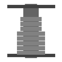

  
  
  
  
  

|Item|`Spool`|
|---|---|
|**Module**|`ARCHEAN_build`|
|**Length**|100 м|

# Description
Различные катушки позволяют соединять компоненты для передачи данных, энергии, предметов или жидкостей.

# Usage
## Creating a cable (connecting two components)
Создание кабеля начинается и заканчивается на разъёме компонента.

Прокладка кабелей полностью свободна и позволяет добавлять столько точек, сколько вы хотите (пока остаётся длина катушки), для настройки формы кабеля. Во время создания кабеля, если вы разместили несколько точек, вы можете удалять точки с помощью `правой кнопки мыши` для корректировки размещения или полной отмены создания кабеля, если точек больше нет.

- Кабели можно укладывать поверх других существующих кабелей и на компоненты. (Для привязки к поверхности компонента необходимо удерживать клавишу `Shift`).
- Вы можете разместить кабель на внутренней стороне блока/компонента, удерживая клавишу `X`.

## Creating a Flexible Cable
Возможно, вы захотите временно соединить компоненты разных построек или просто связать две постройки вместе.
Это фактически создаст гибкий кабель.
Две постройки будут эффективно связаны друг с другом и ограничены физическим движком.
Ограничение по силе отсутствует — кабели не отсоединятся.
Вы также можете добавить гибкий кабель между двумя компонентами одной постройки, удерживая `X`, чтобы получить прямой (возможно, слегка изогнутый) кабель, подверженный воздействию гравитации.

## Deleting a cable
Вы можете удалить кабель `правой кнопкой мыши`, если инструмент в вашей руке — соответствующая катушка кабеля.

## Painting cables
Вы можете красить кабели с помощью [Paint Tool](../tools/PaintTool.md) так же, как и блоки.
Кабели предлагают два дополнительных варианта настройки:
- `Shift` для покраски кабеля с эффектом прозрачности
- `X` для покраски кабеля обычным способом с эффектом полос

Вы также можете комбинировать оба эффекта, удерживая обе клавиши.

---
>- *При создании кабеля, если он отказывается создаваться, вероятно, у вас недостаточно доступной длины в текущей катушке.*
>- *Кабели не имеют ограничений по передаче или потерь, связанных с длиной.*
>- *Кабели не определяют направление того, что они передают.*
>- *Кабель нельзя изменить после размещения — его нужно удалить.*
>- *Гибкие кабели существенно влияют на производительность, тогда как обычные кабели не влияют на производительность вообще, даже если их тысячи в постройке. Старайтесь использовать обычные кабели, где это возможно.*
