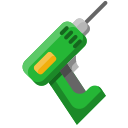

    

|Item|`ConstructorTool`|
|---|---|
|**Module**|`ARCHEAN_build`|

# Description
The constructor tool is the primary tool used for building in Archean. It enables you to add or remove frames and blocks of various shapes.

# Usage
You can enable tooltips to guide you in using the constructor tool through the **help / settings** menu accessible via the `F1` key.
These tooltips will provide you with information on the different actions possible with the constructor tool depending on the selected mode.

