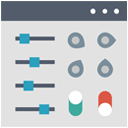

  

|Item|`DashboardTool`|
|---|---|
|**Module**|`ARCHEAN_build`|

# Description
The dashboard tool is used to design dashboards with smaller components in a more flexible manner.

# Usage
You can enable tooltips to guide you in using the dashboard tool through the **help / settings** menu accessible via the `F1` key.
These tooltips will provide you with information on the different actions possible with the dashboard tool depending on the selected mode.

