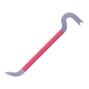

    

|Item|`DestructorTool`|
|---|---|
|**Module**|`ARCHEAN_build`|

# Description
The destructor is a tool that, when equipped, allows the player to delete targeted components.

# Usage
`Hold Right click` to activate the destruction mode.
`Left click` on the component to destroy it.

---
>- *You cannot destroy cables, blocks or beams with this tool.*
>- *You cannot delete a seat if it is occupied by a player.*
>- *If an OwnerPad had been added, you must have the `Build` permission to destroy a component.*
