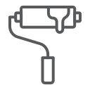

    

|Item|`PaintTool`|
|---|---|
|**Module**|`ARCHEAN_build`|

# Description
The Paint Tool is a tool that allows you to paint blocks, cables, labels or components in different colors.

# Usage
- To display the Paint Tool configuration menu, you must hold the `C` key.
- You can change the material type using the `mouse wheel`.
- You can choose the color by moving the `mouse cursor` over the desired color.
- The `left click` is used to paint components or blocks.
- The `right click` is used to pick a color (from blocks only).

---
>- *Components can have up to two paintable zones.*
>- *Applying a color to a block is done per face.*
>- *Cables have additional customization options, see [Spool](../consumables/Spool.md#painting-cables).* 
