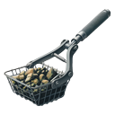

    

|Item|`RockRakeTool`|
|---|---|
|**Module**|`ARCHEAN_celestial`|

---

# Description
The RockRake tool is a tool that allows you to collect rocks on the ground faster than by hand. It is mainly used in adventure mode as an intermediate level between hand collection and mining drill.

# Usage
The RockRake tool offers two main advantages over hand collection:
- Holding down the `left mouse button` allows you to continuously pick up rocks, while the hand can only pick up one at a time.
- The `right mouse button` allows you to know the composition of the targeted rock.