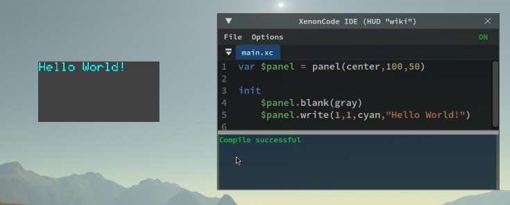

# HUD Management in Archean
## Introduction
The HUD (Heads-Up Display) system allows players to create their own graphical interfaces to display information on the screen such as texts, buttons, drawings... using XenonCode.

HUDs are entirely managed by the client, which means that each player has their own HUDs and other players cannot see them. However, they can communicate with [Beacon](../components/navigation/Beacon.md) or other players through an integrated system that allows sending and receiving data on frequencies.

It is important to note that since HUDs are completely client-side, they will be available on all servers/worlds you connect to. You cannot set them for a specific server/world except manually as indicated in the next section.

> Additional Information:
> - When using a button or any other interaction on a HUD, the `right click` is preferred to avoid grabbing the mouse look.

## Creating a HUD
Since HUDs are a completely client-side feature, they do not have items directly associated with them in the game. To create a HUD, you need to go through the game settings menu `F1` and go to the `HUD` tab.


From this menu, you can create as many HUDs as you want and activate/deactivate them at your convenience using the checkbox. It is important to know that each HUD is a unique instance and does not natively communicate with other HUDs, although communication is possible through a feature that will be explained later on this page.

Once your HUD is created, you can open its IDE to code your features.

## Creating your first graphical interface
HUDs use panels to display content on the screen. A panel can contain graphical elements such as texts, buttons, drawings...

You can create as many panels as you want and position them on the screen as you see fit.
To create a panel, the syntax is similar to what you might find on a [dashboard](dashboard.md) screen.
    
```xc
var $panel = panel(center, sizeX, sizeY)
```

Example of a HUD displaying "Hello World" in the center of the screen in a gray box of 100x50 pixels

```xc
var $panel = panel(center, 100, 50)

init
    $panel.blank(gray)
    $panel.write(1, 1, cyan, "Hello World")
```



# List of functions specific to HUDs

### Functions related to the game window
```xc
screen_w ; returns the width of the game window
screen_h ; returns the height of the game window
fov ; returns the player's camera field of view (radians)
aim_distance ; returns the distance of whatever the player is aiming at in meters

mouse_x ; returns the x position of the mouse on the game window
mouse_y ; returns the y position of the mouse on the game window

set_resolution_scale($scale)
; Sets the internal resolution of the HUD, from 1 (full resolution) to 8 (lower resolution).
; Default is 2. The HUD is rendered at screen resolution divided by $scale.
; Final display size is affected by ($scale * ui_scaling).
```
> It is important to remember that the UI Scaling configured in the game settings influences the values returned by these functions. 

### Functions related to panels
```xc
var $myPanel = panel(center, $width, $height) ; creates a panel centered on the screen of size width, height
; 'Center' can be replaced by 'Top', 'top_left', 'top_right', 'bottom', 'bottom_left'...

$myPanel.set_position($x, $y) ; moves the panel to position x, y
$myPanel.set_size($width, $height) ; resizes the panel to size width, height

$myPanel.width ; returns the width of the panel
$myPanel.height ; returns the height of the panel

; ENTRY POINT
click.$myPanel ($x:number, $y:number) ; returns the click position within the panel
```
Note: The way to draw on the panel is similar to the [dashboard screen](../xenoncode/dashboard.md#screen-rendering-functions)

### Functions related to the integrated computer
```xc
set_cps(25) ; sets the number of HUD cycles per second
```

### Functions related to communication
```xc
var $beacon = beacon($transmitFreq, $receiveFreq) ; Allows sending/receiving data

var $data = $beacon.data ; returns the data received by the beacon
var $distance = $beacon.distance ; returns the distance between the player and the remote beacon
var $dir_x = $beacon.direction_x ; returns the x direction between the player and the remote beacon
var $dir_y = $beacon.direction_y ; returns the y direction between the player and the remote beacon
var $dir_z = $beacon.direction_z ; returns the z direction between the player and the remote beacon
var $is_recv = $beacon.is_receiving ; whether this beacon is receiving data on the receiving frequency

$beacon.transmit($data) ; sends data on the transmission frequency
```

# Shared Values
Shared values is a feature that allows retrieving and setting information in the player's client.

A list of shared values is natively available to allow you to retrieve information about the player's environment.

```xc
var $comp = get("avatar_sensor_environment_composition") ; returns the composition of the player's environment
var $density = get("avatar_sensor_density") ; returns the density of the player's environment
var $temp = get("avatar_sensor_temperature") ; returns the temperature of the player's environment in Kelvin
var $gravity = get("avatar_sensor_gravity") ; returns the gravity of the player's environment
var $speed = get("avatar_sensor_speed") ; returns the player's speed in m/s
var $alt = get("avatar_sensor_altitude") ; returns the player's altitude in meters
var $alt = get("avatar_sensor_altitude_absolute") ; returns the player's absolute altitude in meters
var $view = get("avatar_is_3rd_person") ; returns whether the player is in third person view

var $inv = get("avatar_inventory") ; returns the player's inventory as a string of key values
var $belt = get("avatar_belt") ; returns the content of the belt as a string of key values
var $mass = get("avatar_mass") ; returns the mass of the avatar including inventory in kg (Avatar base mass is 100kg)
var $water = get("avatar_water_level") ; returns the player's water level
var $o2 = get("avatar_oxygen_level") ; returns the player's oxygen level
var $h2 = get("avatar_hydrogen_level") ; returns the player's hydrogen level
```

## Creating your own shared values
It is possible to create your own shared values to transmit/receive, for example, information between HUDs.
```xc
set("mySharedValue", "Hello World") ; sets a shared value identified by "mySharedValue" with the value "Hello World"
get("mySharedValue") ; returns the value of the shared value "mySharedValue"
```

# Virtual screen and screencopy
These functions are available in HUDs and work the same way as on computers.
Refer to the documentation for the [virtualscreen](../xenoncode/computer.md#virtual-screen-function) and [screen_copy](../xenoncode/computer.md#screen-rendering-functions-draw-on-a-virtual-screen).

# Examples
### HUD that displays the player's speed
```xc
var $panel = panel(top,100,12)

tick
	$panel.blank()
	$panel.text_align(top)
	$panel.write(1,1,cyan,text("Speed: {0} km/h", get("avatar_sensor_speed")*3.6))
```
<video controls width="600">
    <source src="hud-img/speedDemo.mp4" type="video/mp4">
</video>

### HUD that targets a beacon and displays the distance
```xc
var $panel = panel(center, 50,50)
var $beacon = beacon("", "target")

function @target_beacon($b:beacon, $p:panel, $width:number, $height:number, $color:number)
    if $b.direction_z > 0
        var $f = screen_w / (2 * tan(fov / 2))
        var $rz = $b.direction_z * (screen_w / screen_h)
        var $x_proj = ($b.direction_x * $f) / $rz
        var $y_proj = ($b.direction_y * $f) / $rz
        var $x = screen_w / 2 + $x_proj - $width / 2
        var $y = screen_h / 2 - $y_proj - $height / 2
        $p.set_position($x, $y)
        $p.set_size($width, $height)
        $p.blank()
        $p.draw_rect(0, 0, $width, $height, $color)
        $p.text_align(center)
        $p.write(text("{0.0} m", $b.distance))

tick
    @target_beacon($beacon, $panel, 50, 50, green)
```
<video controls width="600">
    <source src="hud-img/targetDemo.mp4" type="video/mp4">
</video>