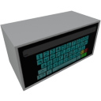

    

|Component|`Keyboard`|
|---|---|
|**Module**|`ARCHEAN_hid`|
|**Mass**|2 kg|
|[**Size**](# "Based on the component's occupancy in a fixed 25cm grid.")|50 x 25 x 25 cm|
#
---
# Description
Keyboard 是一个提供触摸键盘的组件，用于向其他组件发送字母数字值。

# Usage
您可以按 `F` 键使用键盘的触摸按钮输入字母数字值，输入的内容将显示在 Keyboard 屏幕上，但只有在按下确认按钮（绿色）后才会生效/更新。

黄色按钮允许您删除最后输入的字符，红色按钮允许您清除所有内容。

> - `^` 允许在小写和大写之间切换
> - `!?` 显示特殊字符
> - 当按下确认按钮时，通道 1 会发送 `1` 持续 1 个 tick，否则发送 `0`。
