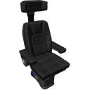

  

|Component|`PilotSeat`|
|---|---|
|**Module**|`ARCHEAN_avatar`|
|**Mass**|50 kg|
|[**Size**](# "Based on the component's occupancy in a fixed 25cm grid.")|75 x 75 x 175 cm|
#
---

# Description
Pilot Seat 允许玩家使用键盘、手柄或摇杆的绑定载具控制来控制组件（在不同通道上发送值）。

# Usage
按 `R` 坐入座位。
按 `R` 离开座位。

> 如果您偏好之前按住 R 一秒的操作方式，可以在游戏设置中启用 **Hold key to Exit Seat**。

> 坐着时，您可以使用 `R` 键移动到附近的另一个座位，无需先离开当前座位。
> 离开座位时，系统会记住您进入座位时相对于建造的位置，离开时您将回到那个位置。

## Configuration
在使用 `V` 键访问的 Pilot Seat 信息窗口中：

| Option | Description |
|--------|-------------|
| **Smooth Controls** | 为没有摇杆的玩家平滑键盘输入 |
| **Emit user token on Channel 0** | 在通道 0 上发送用户令牌而不是 `1`（默认启用） |

用户令牌可与 [HUD Controller](../miscellaneous/HudController.md) 配合使用来识别哪个用户坐在座位上。

### List of outputs
|Channel|Function|Range|
|---|---|---|
|0|Using|1 或坐在 Pilot Seat 中的用户令牌，否则为 0|
|1|Backward/Forward|-1.0 to +1.0|
|2|Left/Right|-1.0 to +1.0|
|3|Down/Up|-1.0 to +1.0|
|4|Pitch|-1.0 to +1.0|
|5|Roll|-1.0 to +1.0|
|6|Yaw|-1.0 to +1.0|
|7|Main Thrust|0.0 to 1.0|
|8|Aux 1|0 or 1|
|9|Aux 2|0 or 1|
|10|Aux 3|0 or 1|
|11|Aux 4|0 or 1|
|12|Aux 5|0 or 1|
|13|Aux 6|0 or 1|
|14|Aux 7|0 or 1|
|15|Aux 8|0 or 1|
|16|Aux 9|0 or 1|
|17|Aux 0|0 or 1|

> 如果存在 [OwnerPad](../miscellaneous/OwnerPad.md)，您必须拥有 "`Sit`" 权限才能坐入座位，以及 `Interact` 权限才能使用控制。
