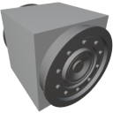

  

|Component|`FluidBridge`|
|---|---|
|**Module**|`ARCHEAN_junction`|
|**Mass**|1 kg|
|[**Size**](# "Based on the component's occupancy in a fixed 25cm grid.")|25 x 25 x 25 cm|
|**Push/Pull Fluid**|Accept Push/Pull -> Forwards action to other side|
#
---
# Description

Fluid Bridge 是一种组件，用于将流体端点重新定位到另一个位置。
