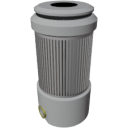

|Component|`SabatierReactor`|
|---|---|
|**Module**|`ARCHEAN_chemical`|
|**Mass**|200 kg|
|[**Size**](# "Based on the component's occupancy in a fixed 25cm grid.")|100 x 100 x 200 cm|
|**Push/Pull Fluid**|Accept Push/Initiate Push|
#
---

# Description
Sabatier Reactor 是一种能够将二氧化碳（CO2）和氢气（H2）转化为甲烷（CH4）的组件。

# Usage
Sabatier Reactor 需要高压电力输入，运行时最高消耗 10 kW。它直接从周围空气中捕获 CO2，因此必须放置在含有 CO2 的环境中才能工作。

要启动转化过程，只需将氢气源连接到其黄色输入端口。产生的甲烷可以从红色输出端口收集。

### Production
Sabatier Reactor 每秒最多可处理 0.1 kg 的氢气，每秒可产生 0.2 kg 的甲烷。

> Sabatier Reactor 在反应过程中会向环境释放水（H2O）。这些水通常不可见，但在密封的体积中会开始积聚。
