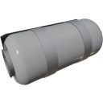

  

|Component|`SmallFluidTank`|
|---|---|
|**Module**|`ARCHEAN_tank`|
|**Mass**|30 kg|
|[**Size**](# "Based on the component's occupancy in a fixed 25cm grid.")|50 x 50 x 100 cm|
|**Push/Pull Fluid**|Initiate Push, accept Push/Pull|
#
---

# Description
Small Fluid Tank 是一种可以存储各类流体的组件。

总容量：`0.20 m³`

### List of output
|Channel|Function|Value|
|---|---|---|
|0|Fluid level|`0.0` to `1.0`|
|1|Fluid content|[Key-value](/xenoncode/documentation.md#key-value-objects)|
|2|Fluid temperature|Kelvin|
