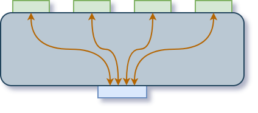

  

|Component|`ItemJunction`|
|---|---|
|**Module**|`ARCHEAN_junction`|
|**Mass**|20 kg|
|[**Size**](# "Based on the component's occupancy in a fixed 25cm grid.")|25 x 25 x 100 cm|
|**Push/Pull Item**|Accept Push/Pull -> Forwards action to other side|
#
---
# Description
Item Junction 是一种允许分配或汇集物品的组件。
不会影响堆叠。

# Usage
Item Junction 按照下方示例图所示的逻辑传输物品。具有 4 个端口的面上的端口仅与只有 1 个端口的面上的端口进行通信。

当物品通过该组件底部端口进入时，使用轮询（round robin）逻辑进行分配。

  

