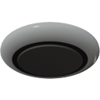

  

|Component|`Lamp`|
|---|---|
|**Module**|`ARCHEAN_light`|
|**Mass**|1 kg|
|[**Size**](# "Based on the component's occupancy in a fixed 25cm grid.")|25 x 50 x 50 cm|
#
---
# Description
Lamp 是一种可以照亮大面积区域的组件，最大照射角度为 170°。特别适合安装在天花板上，用于照明房间或工作区域。

# Usage
Lamp 需要低压供电，根据其信息菜单（按 `V` 键访问）中设置的功率，最高消耗 1000 W。

Lamp 的颜色可以通过信息菜单或数据端口进行更改。

### List of inputs
|Channel|Function|Range|
|---|---|---|
|0|Off/On|0 or 1|
|1|Red|0 to 255|
|2|Green|0 to 255|
|3|Blue|0 to 255|
