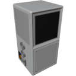

<p align="center">
  
</p>

|Component|`Crafter`|
|---|---|
|**Module**|`ARCHEAN_machines`|
|**Mass**|200 kg|
|[**Size**](# "Based on the component's occupancy in a fixed 25cm grid.")|100 x 100 x 200 cm|
|**Push/Pull Fluid**|Accept Push, Initiate Pull|
|**Push/Pull Item**|Initiate Push/Pull|
#
---

# Description
Crafter 是一种允许快速制造物品的组件。

# Usage
Crafter 需要高压供电，待机时消耗 500 瓦，运行时消耗 10 kW。

它可以通过集成触摸屏手动控制，也可以通过数据端口进行更高级的控制。


### List of Inputs
|Channel|Function|Value|
|---|---|---|
|0|Continuous Crafting OR Container data|`0` or `1` OR key-value from Container|
|1|Override Craft Selection|text|
|2|Container output for auto-craft|key-value from Container|

### List of Outputs
|Channel|Function|Value|
|---|---|---|
|0|Progress|-1 or 0 to 1|
|1|Craft Selection|text|
|2|Fluid Levels|text|

> #### 信息：
>- 当输出数据中 `progress` 为 `-1` 时，表示配方无法执行，原因可能是缺少资源或请求的制造项在游戏中不存在。
>- 如果因电力不足导致制造失败，Crafter 会显示 **"Not enough power"** 警告。
>- 尽管 Crafter 只有两个流体端口，但它可以通过使用 [Fluid Junction](../fluids/FluidJunction.md) 连接到所有必要的流体源，使用配方所需的任意数量的流体。Crafter 会在需要时自动使用它们。
>- `Fluid Levels` 是一个 key-value 对象，包含 `h2`、`o2` 和 `h2o` 的 0 到 1 之间的值
>
> #### 提示：
> - 您可以简单地使用 [Toggle Button](../controllers/ToggleButton.md) 来启动持续制造，只要按钮处于激活状态且连接的库存中有足够的资源。
>

# Go further with the crafter:
## Simple Auto-Crafting Setup

Crafter 在正确配置后原生支持自动制造行为。

要启用它，只需：
- 将 Crafter 的物品输入和物品输出端口连接到同一个容器。
- 将该容器的数据端口直接连接到 Crafter 的数据端口（通道 0）。

此设置允许 Crafter 通过直接从容器中取用原料来自动处理包含子制造的复杂配方。

只要容器中包含所有所需的原材料，Crafter 将：
- 自动制造缺少的子组件。
- 然后组装最终产品。

这是在不编写任何自定义代码的情况下实现自动制造系统的最简方法。

> - 在此配置中，由于数据端口已连接到容器，您将无法使用 [Toggle Button](../controllers/ToggleButton.md) 启用持续制造。相反，您需要使用其内置屏幕逐一启动制造。
> - 如果您想在此设置中实现真正的持续制造，则需要使用更高级的方法，即使用 XenonCode 来控制 Crafter。

## Continuous Auto-Crafting from a Computer

您可以使用 **通道 2** 从计算机完全控制持续自动制造：

- **Channel 0**：设为 `1` 以启用持续制造
- **Channel 1**：设置要制造的配方名称
- **Channel 2**：连接 Container 的数据输出以启用带递归子制造的自动制造

这允许对 Crafter 进行完全编程控制，同时仍享受自动递归制造逻辑的优势。

## Advanced Auto-Crafting with XenonCode

对于更高级的自动制造系统，或要完全控制制造过程，可以使用 XenonCode。

Crafter 提供四个 XenonCode 函数来获取可用配方的信息：

- `get_recipes_categories("crafter")`：返回 Crafter 中可用的配方类别列表。
- `get_recipes("crafter", "PARTS")`：返回 `PARTS` 类别中可用的配方列表。
- `get_recipe("crafter", "Circuit")`：返回 `Circuit` 配方所需的原料列表。
- `get_recipe_label("ARCHEAN_parts.Circuit")`：返回可读的显示名称（例如 `"Circuit"`）。

#### Built-in Program
Crafter 的内置程序——即在 *Simple Auto-Crafting Setup* 中自动使用的程序——已经使用这些函数实现了完整的自动制造逻辑。您可以将其作为灵感来源，或构建自己的自定义程序以满足更高级或特定的需求。


```xc
var $cursor = 0
var $currentCraft:text
var $categories:text

var $container:text
array $autocraftList:text
array $autocraftQty:number

var $upX : number
var $upY : number
var $downX : number
var $downY : number
var $initTime : number
var $error : number
var $popup = 1
var $continuous = 0
var $dirty = 0
var $maxScroll = 0

function @screenDirty()
	$dirty = 1

function @error()
	if !$error
		@screenDirty()
	$error = 1

function @clearError()
	if $error
		@screenDirty()
	$error = 0

recursive function @autoCraft($item:text, $n:number)
	var $recipe = get_recipe("crafter", $item)
	if $recipe
		$autocraftList.append($item)
		$autocraftQty.append($n)
		$container.$item += $n
		foreach $recipe ($k,$v)
			$container.$k -= $v * $n
			if $container.$k < 0
				recurse($k, -$container.$k)
				if $error
					break
	elseif $container.$item < $n && $item != "H2" && $item != "O2" && $item != "H2O"
		$autocraftList.clear()
		$autocraftQty.clear()
		@error()

function @drawScreen()
	$dirty = 0
	blank()
	text_size(1)
	
	var $p = progress
	if size($autocraftList)
		$p = ($p + 1) / (size($autocraftList) + 1)
	
	if time < $initTime+4
		if time > $initTime+1
			write(10,10,cyan,"Initializing Crafter...")
		return
	
	var $dpIndex = 0
	foreach $categories ($category, $open)
		if button(0,(12*$dpIndex)-$cursor,color(10,10,10),screen_w-17,11)
			$categories.$category!!
			@screenDirty()
		write(3,((12*$dpIndex)+2)-$cursor,color(180,180,180),$category)
		$dpIndex++
		if $open
			array $craftArray:text
			$craftArray.from(get_recipes("crafter", $category), ",")
			foreach $craftArray ($index, $craft)
				if button(0,(12*$dpIndex)-$cursor,color(10,10,10),screen_w-17,11)
					if $currentCraft == $craft
						$currentCraft = ""
						cancel_craft()
						$autocraftList.clear()
						$autocraftQty.clear()
					else
						cancel_craft()
						$autocraftList.clear()
						$autocraftQty.clear()
						$currentCraft = $craft
						@clearError()
						if $container; Autocrafting when a container is connected
							@autoCraft($craft, 1)
							if size($autocraftList)
								start_craft($autocraftList.last)
						else
							start_craft($craft)
					@screenDirty()
				if $currentCraft == $craft
					if $p > 0 and $p < 1
						if $error
							draw(0,(12*$dpIndex)-$cursor,color(128,0,0,64),(screen_w-17)*$p,11)
						elseif $continuous
							draw(0,(12*$dpIndex)-$cursor,color(0,0,64,64),screen_w-17,11)
						else
							draw(0,(12*$dpIndex)-$cursor,color(0,64,64,64),(screen_w-17)*$p,11)
					elseif $p == 1
						draw(0,(12*$dpIndex)-$cursor,color(0,128,0,64),screen_w-17,11)
						@clearError()
					elseif $p < 0
						draw(0,(12*$dpIndex)-$cursor,color(30,15,15),screen_w-17,11)
					if $error
						write(10,(12*$dpIndex+2)-$cursor,color(80,40,0),get_recipe_label($craft))
					else
						write(10,(12*$dpIndex+2)-$cursor,color(20,80,0),get_recipe_label($craft))
					var $recipeInputs = get_recipe("crafter", $currentCraft)
					$dpIndex++
					foreach $recipeInputs ($item, $qty)
						write(20,(12*$dpIndex+2)-$cursor,color(100,100,100), get_recipe_label($item) & ": " & $qty)
						$dpIndex++
				else
					write(10,(12*$dpIndex+2)-$cursor,color(100,100,100),get_recipe_label($craft))
					$dpIndex++

	if button(screen_w-16,0,color(20,20,20),15,screen_h/2)
		if $cursor > 0
			$cursor -= 50
			if $cursor < 0
				$cursor = 0
		@screenDirty()
	if button(screen_w-16,screen_h/2+1,color(20,20,20),15,screen_h/2)
		$cursor = clamp($cursor + 50, 0, $maxScroll)
		@screenDirty()
	
	; Update max scroll limit based on content
	$maxScroll = max(0, $dpIndex*12 - screen_h/5*4)
	
	draw_triangle(0+$upX,0+$upY,10+$upX,0+$upY,5+$upX,-9+$upY,white,white)
	draw_triangle(0+$downX,0+$downY,10+$downX,0+$downY,5+$downX,9+$downY,white,white)

	if $popup
		draw_rect(4,5,196,195,color(150,150,150,240),color(40,40,40,240))
		text_align(top)
		write(0,10,color(0,200,225),"How to enable Auto-Crafting ?")
		text_align(top_left)
		write(7,30,color(200,200,200),"1. Connect both Item ports of")
		write(25,40,color(200,200,200),"the Crafter to the same")
		write(25,50,color(200,200,200),"Container")
		write(7,70,color(200,200,200),"2. Connect the Container's Data")
		write(25,80,color(200,200,200),"port to the Crafter's Data")
		write(25,90,color(200,200,200),"port")
		write(15,110,color(200,200,200),"The Crafter will recursively")
		write(15,120,color(200,200,200),"craft everything using items")
		write(15,130,color(200,200,200),"from the Container.")
		if button_rect(25,150,175,180,color(120,120,120),color(30,30,30))
			$popup = 0
			@screenDirty()
		text_size(2)
		write(56,157,white,"Got it!")
	if !enough_power
		text_size(2)
		text_align(center)
		draw_rect(0,0,screen_w,screen_h,color(0,0,0,220),color(0,0,0,220))
		draw_rect(25,70,175,125,color(120,0,10,230),color(80,20,20,230))
		write(0,-3,color(200,200,200),"Not enough\npower")
		@screenDirty()
		
init
	if $initTime == 0
		$initTime = time
	$upX = screen_w-14
	$upY = screen_h/4
	$downX = screen_w-14
	$downY = screen_h*3/4-2
	array $recipesCategories : text
	$recipesCategories.from(get_recipes_categories("crafter"), ",")
	foreach $recipesCategories ($i, $category)
		$categories.$category = 0
	
tick
	var $p = progress
	if $p < 0
		@error()
	
	; Autocrafting when a container is connected
	if $p >= 1 and size($autocraftList)
		var $qty = $autocraftQty.last - 1
		$autocraftQty.pop()
		if $qty > 0
			$autocraftQty.append($qty)
		else
			$autocraftList.pop()
		if size($autocraftList)
			start_craft($autocraftList.last)
	
	if ($p > 0 and $p < 1 and !$continuous) or time < $initTime+5 or $dirty
		@drawScreen()
	var $fluidLevels = ""
	$fluidLevels.h2 = text("{0.00}", fluid_level("H2"))
	$fluidLevels.h2o = text("{0.00}", fluid_level("H2O"))
	$fluidLevels.o2 = text("{0.00}", fluid_level("O2"))
	if $error
		output.0 (-1, $currentCraft, $fluidLevels)
	else
		output.0 ($p, $currentCraft, $fluidLevels)
	$container = ""
	
click
	@screenDirty()

scroll($scroll:number)
	; Scroll by ~1 line (12 pixels) per scroll step, respecting limits
	$cursor = clamp($cursor - $scroll * 16, 0, $maxScroll)
	@screenDirty()

input.0 ($onOrContainer:text, $craft:text, $autocraftContainer:text)
	print($onOrContainer, $craft, $autocraftContainer)

	; Autocrafting when a container is connected
	if $onOrContainer != "0" and $onOrContainer != "1"
		$container = $onOrContainer
		return
	
	var $on = $onOrContainer:number
	if $continuous != $on
		@screenDirty()
	$continuous = $on
	if time < $initTime+5
		return
	var $p = progress
	if $on and ($p == 0 or $p == -1 or $p == 1)
		if $craft and $currentCraft != $craft
			$currentCraft = $craft
			$autocraftList.clear()
			$autocraftQty.clear()
			@clearError()
			@screenDirty()
		if $p == 1 or $p == 0
			@clearError()
		elseif $p == -1
			@error()
		if $autocraftContainer
			$container = $autocraftContainer
			@autoCraft($currentCraft, 1)
			if size($autocraftList)
				start_craft($autocraftList.last)
		else
			start_craft($currentCraft)
	
	$onOrContainer = ""
	$craft = ""
	$autocraftContainer = ""
```
