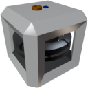

  
  

|Component|`SmallGyroscope`| `Gyroscope`|
|---|---|---|
|**Module**|`ARCHEAN_gyroscope`|`ARCHEAN_gyroscope`|
|**Mass**|50 kg|200 kg|
|[**Size**](# "Based on the component's occupancy in a fixed 25cm grid.")|50 x 50 x 50 cm|100 x 100 x 100 cm|
#
---

# Description
Gyroscope 是一种在供电并激活后能够抑制角速度的组件。它主要用于稳定载具或在零重力环境下消除角动量。

# Power Supply
SmallGyroscope 通过**低压**供电，Gyroscope 通过**高压**供电。它们在启动时消耗较多电力，随后在达到通过数据端口请求的转速时逐渐降低功耗。

# Usage
要启动 Gyroscope，必须在其数据端口接收一个介于 `0.0` 和 `1.0` 之间的值，以降低/增加其旋转速度，从而增强其稳定效果。

Gyroscope 允许通过利用内部惯性轮产生的力矩，通过数据端口手动调整载具的朝向。它将根据其方向和旋转速度进行作用。

### List of inputs
|Channel|Function|range|
|---|---|---|
|0|Speed| 0.0 to 1.0|
|1|Control| -1.0 to +1.0|

>Gyroscope 的效果相对于建筑重量是有限的。您可以增加 Gyroscope 的数量来增强稳定效果。
