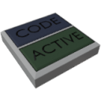

  

|Component|`HudController`|
|---|---|
|**Module**|`ARCHEAN_hud`|
|**Mass**|1 kg|
|[**Size**](# "Based on the component's occupancy in a fixed 25cm grid.")|25 x 25 x 25 cm|
#
---

# Description

HUD Controller 是一种允许创建 HUD 并在玩家订阅后显示在其屏幕上的组件。例如，它可以在建筑上创建一个或多个自定义界面。

# Usage
当您在建筑上放置 HUD Controller 时，它有两个按钮：
- **Code**：
	- 打开 XenonCode IDE，您可以在其中编写 HUD 的代码。有关创建 HUD 的更多信息，请参阅 [HUD](../../xenoncode/hud.md) 部分。
- **Active**： 
	- 允许订阅或取消订阅 HUD Controller。

> 当 IDE 打开时，只要 IDE 保持打开状态，您就会自动订阅 HUD Controller。

## Control via its data port
### Usage with a [Pilot Seat](../controllers/PilotSeat.md)
也可以通过数据端口使用 [Pilot Seat](../controllers/PilotSeat.md) 订阅 HUD Controller，Pilot Seat 具有在通道 0（Using）上发送唯一标识符（Token）的独特能力。您可以将 [Pilot Seat](../controllers/PilotSeat.md) 直接连接到 HUD Controller 的数据端口，这样当您坐在 [Pilot Seat](../controllers/PilotSeat.md) 中时订阅 HUD Controller，离开时取消订阅。

您也可以使用连接到 [Computer](../computers/Computer.md) 的 [Pilot Seat](../controllers/PilotSeat.md) 来订阅 HUD Controller。在这种情况下，您需要使用 [Pilot Seat](../controllers/PilotSeat.md) 的通道 0（Using）将 Token 发送到 HUD Controller 的数据端口。

> - 请确保在 [Pilot Seat](../controllers/PilotSeat.md) 的信息窗口（按 `V` 键访问）中启用了 `Emit user token on Channel 0` 设置。这确保用户的 Token 在 [Pilot Seat](../controllers/PilotSeat.md) 的通道 0 上传输，而不是 `0` 或 `1`。
> - 我们建议不要获取 Token 并将其硬编码。出于安全原因，Token 在玩家每次连接到服务器时都会重新生成。如果恶意玩家获得了另一个玩家的 Token，他们可以在该玩家不知情的情况下在其 HUD 上显示任何内容。

### HUD Controller for server administrators
HUD Controller 还可以用于创建对服务器上所有玩家可见的 HUD。
为此，管理员只需在 HUD Controller 所在的建筑上放置一个 [OwnerPad](OwnerPad.md)。

然后，将 HUD Controller 连接到 [Computer](../computers/Computer.md)，并在 HUD Controller 的通道 0 上发送文本 `*`，指示其订阅所有 Token。

> **注意**：当服务器管理员为所有玩家创建 HUD Controller 时，它无法被禁用。因此，必须注意不要创建可能对玩家造成干扰的 HUD Controller。
